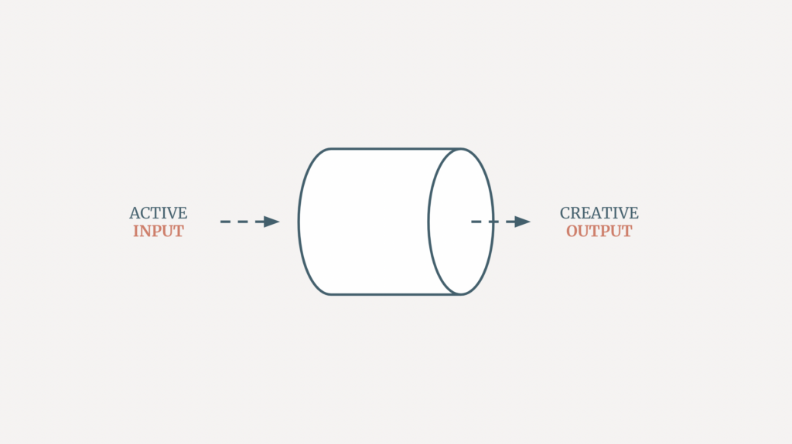

When was the last time you had an ‘aha’ moment? If you’re like most people in today’s era of noisy information, it may have been a while. We have access to limitless data, and yet this rarely leads to brilliant creative insights. In fact, this constant assault on our attention can quietly corrode our creative capacities.  

你上一次获得 "啊哈 "时刻是什么时候？如果你和当今信息嘈杂时代的大多数人一样，可能已经有一段时间了。我们可以接触到无穷无尽的数据，但这些数据却很少能给我们带来卓越的创造性见解。事实上，这种对我们注意力的持续攻击会悄无声息地侵蚀我们的创造能力。

When we’re perpetually overloaded, our brains never get a chance to make the unexpected connections that spark original ideas. When we mindlessly consume whatever the algorithm is feeding us, we don’t provide our minds with the creative fuel it needs to generate interesting ideas.   

当我们长期处于超负荷工作状态时，我们的大脑永远没有机会建立意想不到的联系，从而激发出独创性的想法。当我们无意识地消费算法提供给我们的任何东西时，我们就无法为大脑提供产生有趣想法所需的创意燃料。

To get quality creative output, you need quality creative input. So, how do you balance the two?  

要想获得高质量的创意输出，就需要高质量的创意输入。那么，如何平衡这两者呢？

## Anti-fuel for creativity  

创意的反燃料

We live in an era where the overall availability of information is not a problem anymore. Social media and endless browsing bombard us with a constant stream of new information. But our brains were not built to handle the constant novel stimuli of the digital age.  

我们生活在这样一个时代，信息的全面供应已不再是问题。社交媒体和无休止的浏览向我们轰炸着源源不断的新信息。但我们的大脑并不是为应对数字时代持续不断的新奇刺激而生的。

Scientists have [found](https://www.pnas.org/doi/10.1073/pnas.0903620106) that excessive multi-tasking and switching between different streams of information can overtax our working memory. This makes it harder for our brains to filter out irrelevant details, engage in deep thinking, and make meaningful connections, which limits our ability to think creatively.  

科学家发现，过度多任务处理和在不同信息流之间切换会过度消耗我们的工作记忆。这会使我们的大脑更难过滤掉无关的细节、进行深入思考和建立有意义的联系，从而限制了我们的创造性思维能力。

And we’ve become so used to constantly checking “what’s new” that our minds have become scattered, even when we don’t actively engage with that endless stream of information. In fact, the [mere presence](https://www.journals.uchicago.edu/doi/full/10.1086/691462) of your smartphone next to you can reduce your available cognitive capacity!  

而且，我们已经习惯于不断查看 "最新信息"，以至于我们的思维变得散乱，即使我们并不主动参与到无穷无尽的信息流中。事实上，只要智能手机在你身边，就会降低你的可用认知能力！

Our minds need whitespace to make the unexpected connections that fuel creativity. As the author Julia Cameron puts it: “When a creative artist is fatigued, it is often from too much inflow, not too much outflow.”  

我们的大脑需要留白来建立意想不到的联系，从而激发创造力。正如作家朱莉娅-卡梅隆（Julia Cameron）所说："当一个富有创造力的艺术家感到疲劳时，往往是因为流入的信息太多，而不是流出的信息太多"。

With an endless influx of information competing for our attention, our creative wells often run dry. To revive your imagination, you need to be more intentional about balancing your creative input with your creative output.  

在无穷无尽的信息争相涌入的情况下，我们的创意之井往往会干涸。要唤醒你的想象力，你需要更有意识地平衡你的创意输入和创意输出。

## A better content diet  

更好的内容饮食

Balance your input and your output means aligning what you consume with your creative goals. Consider the information you consume to fuel your mind the same way you would food to fuel your body: not too much, the right ingredients, and the occasional treat.  

平衡你的输入和输出意味着让你的消费与你的创作目标保持一致。就像用食物为身体补充能量一样，用信息为头脑补充能量：不要太多，要有正确的成分，偶尔也要吃点东西。

Here are a few tips to reduce mindless consumption with a content diet:  

以下是一些通过内容饮食减少无意识消费的技巧：

**1\. Limit time on passive social media scrolling.** Use website blockers to restrict aimless browsing if necessary. Checking Twitter or Instagram out of habit rarely inspires creativity. Of course memes can be fun. Just set limits on how much time you allow yourself to indulge in low-value content.  

1.限制被动浏览社交媒体的时间。必要时使用网站拦截器限制漫无目的的浏览。习惯性地查看 Twitter 或 Instagram 很少能激发创造力。当然，备忘录也可以很有趣。只要限制自己沉迷于低价值内容的时间即可。

**2\. Subscribe to carefully curated newsletters aligned to your interests.** Avoid flooding your inbox with subscriptions you don’t have time to read. Add labels so these newsletters go into a dedicated folder you set time aside to read.  

2.订阅根据你的兴趣精心策划的时事通讯。避免你的收件箱被没时间阅读的订阅淹没。添加标签，让这些新闻简报进入你留出时间阅读的专用文件夹。

**3\. Go offline for focused reading.** Read ebooks on your Kindle without distractions. Buy physical books, magazines, and journals to disconnect from the digital bustle. Immersive long-form reading boosts creativity better than skimming content.  

3.离线专注阅读。不受干扰地阅读 Kindle 上的电子书。购买实体书、杂志和期刊，从数字喧嚣中解脱出来。身临其境的长篇阅读比浮光掠影的内容更能提升创造力。

**4\. Keep inspiring materials on hand for quick creative sparks.** Build your [antilibrary](https://nesslabs.com/antilibrary). When you have a spare moment, pull out your inspiration from there rather than social media.  

4.随身携带启发灵感的材料，快速迸发创意火花。建立你的 "反图书馆"。闲暇时，从这里而不是社交媒体上获取灵感。

**5\. Select audio content with intention.** Rather than passively playing radio with random talk shows intercalated with ads, be selective with what you listen to. When driving, exercising or doing chores, put on a podcast or audiobook that feeds your creativity. This includes fiction!  

5.用心选择音频内容。与其被动地播放夹杂着广告的随机脱口秀节目，不如有选择地收听广播。在开车、锻炼或做家务时，播放播客或有声读物，以激发你的创造力。这包括小说！

With more intention, you can craft a content diet that nourishes instead of numbs your imagination, and turn what you take in into a creative catalyst.  

有了更多的用心，你就可以精心设计内容饮食，滋养而不是麻木你的想象力，并将你所吸收的内容转化为创造力的催化剂。

## How to practice active content consumption  

如何进行积极的内容消费

While being mindful of the quantity and quality of information you consume is a great first step, changing how you consume this content is even more powerful. It’s easy to passively read blog posts and watch videos. But it’s better to make it an active endeavor.  

注意信息消费的数量和质量是很好的第一步，而改变内容消费的方式则更为重要。被动地阅读博文和观看视频很容易。但更好的办法是让它成为一种主动的努力。

Not only active content consumption will help you become more intentional with the content you consume (it would be quite hard to write a blog post about that cat video you just watched) but science shows that it will help you remember things better and come up with better ideas later by putting your brain into [focused mode](https://nesslabs.com/learning-how-to-learn).  

主动的内容消费不仅能帮助你更有意识地消费内容（就你刚看过的猫咪视频写一篇博文是很难的），而且科学表明，它能让你的大脑进入专注模式，从而帮助你更好地记忆事物，日后想出更好的点子。

Almost any piece of creative content can be consumed in active mode:  

几乎所有的创意内容都可以在主动模式下消费：

<table data-immersive-translate-walked="7b2f3b9d-f2fa-4e86-a883-367a102369ff"><tbody data-immersive-translate-walked="7b2f3b9d-f2fa-4e86-a883-367a102369ff"><tr data-immersive-translate-walked="7b2f3b9d-f2fa-4e86-a883-367a102369ff"><td data-immersive-translate-walked="7b2f3b9d-f2fa-4e86-a883-367a102369ff"><strong data-immersive-translate-walked="7b2f3b9d-f2fa-4e86-a883-367a102369ff" data-immersive-translate-paragraph="1">Passive&nbsp;被动</strong></td><td data-immersive-translate-walked="7b2f3b9d-f2fa-4e86-a883-367a102369ff"><strong data-immersive-translate-walked="7b2f3b9d-f2fa-4e86-a883-367a102369ff" data-immersive-translate-paragraph="1">Active&nbsp;主动模式</strong></td></tr><tr data-immersive-translate-walked="7b2f3b9d-f2fa-4e86-a883-367a102369ff"><td data-immersive-translate-walked="7b2f3b9d-f2fa-4e86-a883-367a102369ff" data-immersive-translate-paragraph="1">Watch a YouTube video&nbsp;观看 YouTube 视频</td><td data-immersive-translate-walked="7b2f3b9d-f2fa-4e86-a883-367a102369ff" data-immersive-translate-paragraph="1">Make a YouTube video&nbsp;制作 YouTube 视频</td></tr><tr data-immersive-translate-walked="7b2f3b9d-f2fa-4e86-a883-367a102369ff"><td data-immersive-translate-walked="7b2f3b9d-f2fa-4e86-a883-367a102369ff" data-immersive-translate-paragraph="1">Read a blog post&nbsp;阅读博文</td><td data-immersive-translate-walked="7b2f3b9d-f2fa-4e86-a883-367a102369ff" data-immersive-translate-paragraph="1">Take notes and write your own post 做笔记并撰写自己的文章</td></tr><tr data-immersive-translate-walked="7b2f3b9d-f2fa-4e86-a883-367a102369ff"><td data-immersive-translate-walked="7b2f3b9d-f2fa-4e86-a883-367a102369ff" data-immersive-translate-paragraph="1">Listen to a podcast&nbsp;收听播客</td><td data-immersive-translate-walked="7b2f3b9d-f2fa-4e86-a883-367a102369ff" data-immersive-translate-paragraph="1">Share podcast notes on Twitter 在 Twitter 上分享播客笔记</td></tr></tbody></table>

Here are a few ways you can go from passive to active content consumption, from easier to harder:  

以下是几种让你从被动内容消费变为主动内容消费、从容易变为困难的方法：

-   **Make notes by hand or digitally.** Write down key points, memorable quotes, and your own reflections. [Note-making](https://nesslabs.com/from-note-taking-to-note-making) will help you identify the most valuable bits of information and synthesize concepts, and reviewing your notes later will help feed your creativity.  
    
    用手或数字方式做笔记。写下要点、难忘的引语和自己的思考。记笔记可以帮助你找出最有价值的信息和综合概念，稍后回顾你的笔记也有助于激发你的创造力。
-   **Explain new concepts in your own words to others.** You can simply send the link to a friend you think would be interested in the content with a couple of thoughts of your own. Summarizing what you learned and teaching it activates deeper mental processing, which is known as the [generation effect](https://nesslabs.com/generation-effect). As a bonus, having to structure and communicate the ideas often yields new perspectives.   
    
    用自己的话向他人解释新概念。你可以简单地将链接发送给你认为对内容感兴趣的朋友，并附上自己的一些想法。总结所学内容并将其传授给他人可以激活更深层次的思维加工，这就是所谓的 "生成效应"。还有一个好处是，在组织和交流想法时往往会产生新的观点。
-   **Write your own article.** Use what you consumed as inspiration for original output. Creating something new requires you to connect the dots between disparate sources, and putting your thoughts into words to share with the world can help you discover new insights. You may even receive some thought-provoking feedback that will further spark your creativity.

Also consider stepping away from your screen and doing something completely different and unrelated:

-   Take a notebook and go to a park or somewhere beautiful to sit down and relax
-   Try cooking a new recipe you have never tried before
-   Read poetry, a novel, or something unrelated to your field
-   Take a train to go visit a new town and take some photos like a tourist
-   Go to a library and explore a random aisle
-   Find a local meetup in an industry you know little about

In an era where we are expected to be on the receiving end of broadcast communication, designed to make it feel like it was crafted just for us, to be intentional about the content we consume is an act of freedom.

And your brain is great at making random connections given you support those processes by ensuring you have the right balance between creative input and creative output. So try to inject more intentionality in your content diet and practice active content consumption to get those creative juices flowing!
