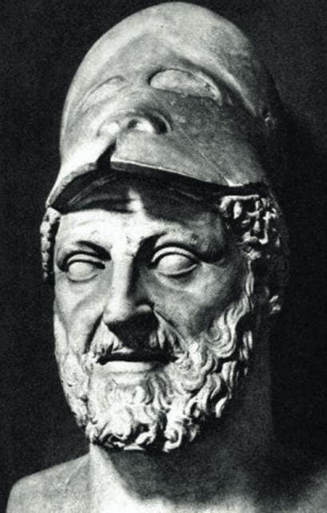
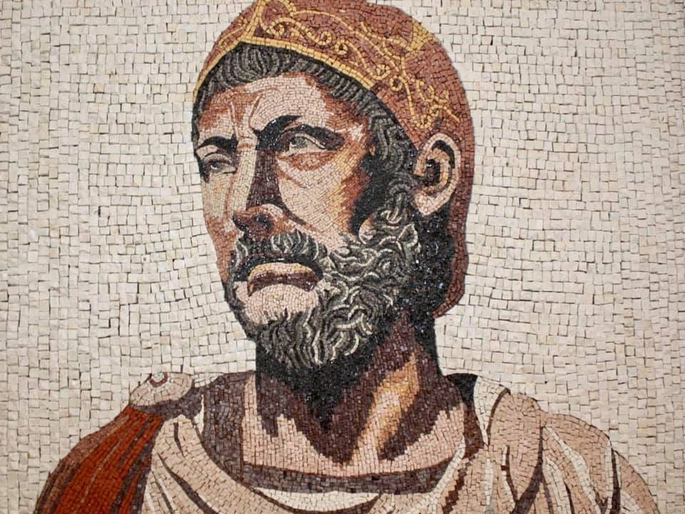

Dear Classical Wisdom Reader,   

亲爱的《古典智慧》读者

Few things appear to be as motivating as sheer, unadulterated hatred. I’m not saying this is a good thing... but it quite literally lights a fire from below and makes the men and women of history _move_.   

很少有东西能像纯粹、无杂质的仇恨那样激发人的斗志。我并不是说这是件好事......但它确实从内心深处燃起熊熊烈火，让历史上的男男女女为之动容。

One excellent example of both the inspiration and destruction caused by such a strong sentiment is the history of Carthage.   

迦太基的历史就是一个很好的例子，它既体现了这种强烈情绪的激励作用，也体现了这种情绪的破坏作用。

Founded in the 6th century, Carthage was Rome’s complete antithesis. While the Romans expanded by conquest, Carthage built its empire on trade... and when the Romans arrived, they had a tendency of outright annihilation of conquered lands, whereas the Carthaginians offered annual tribute for established colonies. The Romans sought a singular Roman identity. The Carthaginians allowed for differing national identities.   

迦太基建立于公元 6 世纪，是罗马的对立面。罗马人通过征服扩张，迦太基则依靠贸易建立帝国......罗马人到达迦太基后，倾向于彻底消灭被征服的土地，而迦太基人则每年向已建立的殖民地进贡。罗马人寻求一种独特的罗马身份。迦太基人则允许不同的民族身份。

And yet, when it came to Rome, Carthage had a huge blindsight, stoked by an all consuming hatred.  

然而，面对罗马，迦太基却有一种巨大的盲目性，而这种盲目性又被一种无尽的仇恨所煽动。

[Share 分享到](https://classicalwisdom.substack.com/p/why-was-hannibal-defeated-and-what?utm_source=substack&utm_medium=email&utm_content=share&action=share&token=eyJ1c2VyX2lkIjoxMjE5NDQwNjIsInBvc3RfaWQiOjE0OTYxMzE1NywiaWF0IjoxNzI3NzI1MjY5LCJleHAiOjE3MzAzMTcyNjksImlzcyI6InB1Yi0zMzUzNzIiLCJzdWIiOiJwb3N0LXJlYWN0aW9uIn0.jA3YZS9xJR1gAh9215WvYDPO3LzW2ZvDxyRomVcKqmQ)

The two great rivals came to a head in 264 BC with the beginning of the Punic Wars. Lasting almost a century and including three decisive wars, the end result is well known. The entire ruin and destruction of Carthage in 146 BC and the emergence of Rome as a superpower.   

公元前 264 年，随着布匿战争的开始，这两个伟大的对手一触即发。战争持续了近一个世纪，包括三次决定性的战争，最终结果众所周知。公元前 146 年，迦太基彻底毁灭，罗马成为超级大国。

But... what would have happened if Carthage had won instead? After all, the famous general Hannibal Barca _almost_ seized Rome after famously crossing the Alps 2,242 years ago today...   

但是......如果迦太基赢了，结果又会如何呢？毕竟，2242 年前的今天，名将汉尼拔-巴尔卡在横渡阿尔卑斯山之后，几乎夺取了罗马......

Indeed, so pivotal was that glamorous arrival with his army of elephants, it is worth a deep dive. So please enjoy today’s article which looks into the humbling of Hannibal below to see exactly why was Hannibal defeated...  

事实上，汉尼拔率领大象军团的辉煌战绩如此举足轻重，值得我们深入探讨。因此，请欣赏今天的文章，我们将在下文中探讨汉尼拔的谦卑，看看汉尼拔究竟为何战败...

Enjoy! And leave your alternative historical suggestions in the comments section below..  

请尽情欣赏！请在下面的评论区留下您的其他历史建议。

All the best, 一切顺利

Anya Leonard 安雅-伦纳德

Founder and Director 创始人兼董事

Classical Wisdom   古典智慧

This week Members will enjoy a Classical Wisdom Standoff: Heraclitus Vs. Parmenides. How does the philosopher of fire and flux compare to the man who posited motion was impossible? What insights did these pre-Socratic thinkers had with regards to the universe and metaphysics? Stay tuned to find out!  

本周，会员们将欣赏到一场古典智慧对决：赫拉克利特与巴门尼德。火与流动的哲学家与认为运动不可能的人相比如何？这些前苏格拉底时期的思想家对宇宙和形而上学有什么见解？敬请关注我们的节目！

**If you aren’t a member, subscribe today to read our upcoming Classical Wisdom Standoff, as well as last week’s podcast with Professors, featuring [Dr. Daisy Dunn](https://classicalwisdom.substack.com/p/the-missing-thread).  

如果您还不是会员，请立即订阅，阅读我们即将推出的《古典智慧对决》，以及上周由 Daisy Dunn 博士主讲的《教授播客》。**

_By Ben Potter 本-波特_

It is one of the most enduring and dramatic images from antiquity, one that widens the eyes, dilates the pupils, quickens the pulse and ignites the imagination – especially when we hear about it in childhood.  

这是古代最经久不衰、最富戏剧性的画面之一，它让人睁大眼睛、瞳孔放大、脉搏加快、浮想联翩--尤其是当我们在童年时代听到它的时候。

Once heard, the moment is forever emblazoned on the mind’s eye: the African general, Hannibal, perilously crosses the craggy and frozen Alps, leads a daring raid on the Northern Italian plains, and takes the fight to the most organized and efficient war machine the world has ever seen… and all of this done astride the back of an elephant!  

一旦听过，那一刻就会永远铭刻在脑海中：非洲将军汉尼拔危险地穿越峭壁冰封的阿尔卑斯山，率军大胆突袭意大利北部平原，与世界上有史以来最有组织、最有效率的战争机器作战......而这一切，都是骑在大象背上完成的！

Battle of Zama, by Giulio Romano  

扎马战役》，朱利奥-罗马诺著

Glossing over, for one second, that large dollop of artistic license that would have made even Livy blush, what else can we say about the self-proclaimed third greatest general who ever lived (behind Alexander the Great and Pyrrhos of Epeiros, if you’re interested)?  

暂且不提那一大把连李维都会脸红的艺术许可证，我们还能说说这位自称史上第三伟大的将军（如果你感兴趣的话，仅次于亚历山大大帝和埃佩罗斯的皮尔罗斯）吗？

Well if, unlike mine, your mind wasn’t stuck on repeat going ‘elephants…elephants…elephants’ when you first heard the story, you might remember Hannibal’s and Carthage’s demise at the battle of Zama in 202BC; a battle that gave rise to one of Republican Rome’s greatest ever heroes, Scipio Africanus.  

如果你不像我一样，在第一次听到这个故事时，脑子里还在重复 "大象......大象......大象"，那么你可能还记得汉尼拔和迦太基在公元前 202 年的扎马战役中的惨败；这场战役造就了罗马共和国有史以来最伟大的英雄之一--西庇阿-阿非利加努斯。

N.B. Scipio’s is obviously still held in pretty high regard, as he is evoked in the third line of the Italian national anthem.  

注：意大利国歌的第三句歌词就提到了他。

So, what happened to change the fortunes of the man who humiliated the Romans at the Battle of Cannae in 216 BC (at which as many as 70,000 Roman soldiers are reported to have died), then pushed his army on to the gates of The Eternal City itself in 211 BC?  

那么，究竟是什么改变了这位在公元前 216 年的坎尼战役中羞辱罗马人（据说有多达 7 万罗马士兵在这场战役中丧生），然后又在公元前 211 年将他的军队推向永恒之城大门的人的命运呢？

In short, the question we’re asking is… (elephants…elephants…stop it!)… Why was Hannibal defeated?  

简而言之，我们要问的问题是......（大象......大象......别说了！）......汉尼拔为何战败？

Many believe the root of the entire Hannibal versus Rome conflict was a family affair; the unfinished business of his father, Hamilcar Barca.  

许多人认为，汉尼拔与罗马冲突的根本原因是家庭事务；他的父亲哈米尔卡-巴尔卡（Hamilcar Barca）未竟的事业。

Hamilcar was an outstanding general who led guerrilla raids against the Romans between 247 and 242BC – tactics that he thought would bring about the eventual demise of the empire. Thus, in an ancient parallel of the epiphany Hitler received in his hospital bed at the end of WWI, when Carthage surrendered to Rome in 241 BC, the betrayal led to a wrath which led to an obsession – Hamilcar wanted to see Rome on her knees.  

哈米尔卡是一位杰出的将军，在公元前 247 年至公元前 242 年期间，他领导游击队突袭罗马人--他认为这种战术将使罗马帝国最终灭亡。因此，与第一次世界大战结束时希特勒在病床上的顿悟相似，公元前 241 年迦太基向罗马投降时，背叛导致了愤怒，而愤怒又导致了痴迷--哈米尔卡希望看到罗马屈膝投降。

This bloodlust intensified when Rome took advantage of Carthage’s dispute with her unpaid mercenaries, broke the terms of the peace treaty, and annexed Sardinia and Corsica.  

当罗马利用迦太基与其未支付报酬的雇佣军之间的纠纷，破坏和约条款，吞并撒丁岛和科西嘉岛时，这种嗜血的欲望更加强烈了。

_Hamilcar Barca, father of Hannibal  

汉尼拔之父哈米尔卡-巴尔卡_

N.B. The particular irony here is that the Roman stereotype of a Carthaginian was one who was both devious and cunning.  

注：这里特别具有讽刺意味的是，罗马人对迦太基人的刻板印象是既狡猾又奸诈。

Despite the red mist, Hamilcar was still an astute tactician, he knew an all out attack on Rome, with her citizen militia, would be doomed to failure; a more circuitous and patient approach was needed.  

尽管被红雾笼罩，但哈米尔卡仍然是一位精明的战术家，他知道对罗马及其公民民兵的全面进攻注定会失败；需要采取一种更迂回、更耐心的方法。

Luckily, as the Carthaginian relationship between the government and the military was much looser than in Rome, Hamilcar didn’t need to wait for permission to go about his business; he fled to Spain and began carving out his own fiefdom.  

幸运的是，由于迦太基政府和军队之间的关系比罗马松散得多，哈米尔卡不需要等待许可就可以开展自己的事业；他逃到了西班牙，开始建立自己的领地。

Whilst, officially, this was part of the Carthaginian Empire, Hamilcar was very much autonomous and acted accordingly; he married his sons to Iberian women, made the indigenous people swear loyalty to him personally (rather than to Carthage), and even issued his own currency.  

虽然在官方意义上，这里是迦太基帝国的一部分，但哈米尔卡却非常自主，并采取了相应的行动；他将自己的儿子娶给伊比利亚女子，让土著人宣誓效忠他本人（而不是迦太基），甚至发行了自己的货币。

[Support the Classics ~ Subscribe Today  

支持经典~立即订阅](https://classicalwisdom.substack.com/subscribe)

This strong command, personal loyalty and not inconsiderable wealth was the bedrock upon which Hannibal could begin to amass a force to even consider an assault on Rome.  

强大的指挥能力、个人的忠诚和不菲的财富是汉尼拔能够开始集结力量，甚至考虑进攻罗马的基石。

Hand in hand with this is the myth of the sacred oath that Hamilcar Barca made Hannibal swear en route to Spain in 237 BC: ‘never to show goodwill to the Romans’. This is often interpreted as a lifelong, inherited and unbreakable vendetta.  

公元前 237 年，哈米尔卡-巴尔卡（Hamilcar Barca）让汉尼拔在前往西班牙的途中立下神圣誓言："永远不向罗马人示好"。这通常被解释为终生的、世代相传的、牢不可破的仇恨。

So, Hannibal spent his upbringing by his father’s side learning the arts of politics and warfare, and, just as importantly, learning how to hate the Romans. Indeed, perhaps our best source on the Hannibalic Wars, Polybius, believed that Hamilcar’s wrath was the driving force for Hannibal’s Roman expedition.  

因此，汉尼拔在父亲身边长大，学习政治和战争艺术，同样重要的是，学习如何憎恨罗马人。事实上，我们关于汉尼拔战争最好的资料来源波里比乌斯可能认为，哈米尔卡的愤怒是汉尼拔远征罗马的动力。

Just as Philip II of Macedon laid the foundations for his, more famous, son, Alexander the Great, so Hamilcar Barca’s drive, ability and success were what allowed Hannibal to be in the position to make such a name for himself in a manner that eclipsed his father’s considerable achievements.  

正如马其顿的腓力二世为他更著名的儿子亚历山大大帝奠定了基础一样，哈米尔卡-巴尔卡的魄力、能力和成功也让汉尼拔有机会扬名立万，使他父亲的巨大成就黯然失色。

However, Hannibal’s single-mindedness may have been what brought about his downfall.  

然而，汉尼拔的一意孤行可能是导致他垮台的原因。

Had Hannibal returned to Spain after his historic victory at Cannae, then he may have been able to wage war against the Romans on ‘home’ turf (and perhaps even destroy Scipio to-be-Africanus).  

如果汉尼拔在坎尼取得历史性胜利后返回西班牙，那么他就有可能在 "主场 "与罗马人开战（甚至有可能消灭即将成为非洲人的西庇阿）。

Indeed, though it was his most famous moment, that moment of irrepressible glamour, the very fact that he crossed the Alps in the late autumn of 218 BC is considered, by some, to be a tactical blunder in itself as many of his precious war elephants and troops died in the process.  

事实上，虽然这是他最著名的时刻，是他不可抵挡的魅力时刻，但有人认为他在公元前 218 年深秋越过阿尔卑斯山这一事实本身就是一个战术失误，因为他的许多珍贵战象和部队在这一过程中丧生。

That Hannibal had learnt to loathe the Romans was, in a way, a millstone around his neck. Had he merely wanted to obliterate Rome, then his task may have been simpler, but he wanted to humiliate her, to see her reduced to a humble and insignificant city-state and force a war-indemnity upon her.  

汉尼拔已经学会了厌恶罗马人，这在某种程度上是他脖子上的一块磨石。如果他只是想消灭罗马，那么他的任务可能会更简单，但他想羞辱罗马，看到她沦为一个卑微和无足轻重的城邦，并迫使她接受战争赔偿。

Such a grand mandate required a grand ego, an ego that Hannibal, the self-proclaimed third greatest general, may not quite have possessed. Without the unequaled arrogance of an Alexander figure, Hannibal never quite convinced anyone that he was the man to rent Rome asunder. Indeed, even though he parked his troops outside the gates of Rome in order to draw Roman troops away from the besieged rebel town of Capua, the act was barely met with a raise-eyebrow of Roman acknowledgment.  

这样一个伟大的任务需要一个伟大的自我，一个自称为第三伟大将军的汉尼拔可能不太具备的自我。由于没有亚历山大那种无与伦比的傲慢，汉尼拔从未让任何人相信他就是那个能把罗马撕成碎片的人。事实上，尽管他将部队驻扎在罗马城门外，以吸引罗马军队离开被围困的叛军重镇卡普亚，但这一举动几乎没有得到罗马人的认可。

[Share 分享到](https://classicalwisdom.substack.com/p/why-was-hannibal-defeated-and-what?utm_source=substack&utm_medium=email&utm_content=share&action=share&token=eyJ1c2VyX2lkIjoxMjE5NDQwNjIsInBvc3RfaWQiOjE0OTYxMzE1NywiaWF0IjoxNzI3NzI1MjY5LCJleHAiOjE3MzAzMTcyNjksImlzcyI6InB1Yi0zMzUzNzIiLCJzdWIiOiJwb3N0LXJlYWN0aW9uIn0.jA3YZS9xJR1gAh9215WvYDPO3LzW2ZvDxyRomVcKqmQ)

The siege of Capua proved too much for the city to withstand. The Romans, swift and merciless to the traitors, completely obliterated it. To rub salt into the wound, and demonstrate a fantastic ‘keep calm and carry on’ attitude, the land on which Hannibal was camping was sold at auction for its full price.  

事实证明，卡普亚城的围攻是无法抵挡的。罗马人对叛徒毫不留情，以迅雷不及掩耳之势将其彻底夷为平地。为了在伤口上撒盐，并表现出 "保持冷静，继续前进 "的奇妙态度，汉尼拔扎营的土地被全价拍卖。

This was a bitter blow as Capua was supposed to be one of the success stories of the invasion, although, generally, Hannibal had little success in recruiting Italian towns to his cause. Although many were dissatisfied with rule from Rome, there was a strong case of ‘better the devil you know’ for many settlements. Not only was Hannibal a foreign barbarian, but he used Gaulish mercenaries. It is difficult to fully communicate the disdain the Italian towns felt for their neighbors from Gaul – they were the Roman bogeyman, even the bravest amongst whom were considered as nothing more than a ‘noble savage’.  

这是一个沉重的打击，因为卡普亚本应是这次入侵的成功故事之一，尽管总体而言，汉尼拔在招募意大利城镇加入他的事业方面收效甚微。尽管许多人对罗马的统治不满，但对许多居民点来说，"宁可信其有，不可信其无 "是一个强有力的理由。汉尼拔不仅是外来的野蛮人，而且还使用高卢雇佣兵。很难完全表达意大利城镇对来自高卢的邻居的蔑视--他们是罗马人的恶棍，即使是最勇敢的人也不过被视为 "高贵的野蛮人"。

**The General Hannibal 汉尼拔将军**

When it came to confident leadership, Hannibal had nothing on the Roman Senate. They never allowed themselves to contemplate that Carthage was anything other than an inconvenience to be dealt with in due course.  

在自信的领导力方面，汉尼拔完全不输给罗马元老院。他们从不允许自己认为迦太基只是一个在适当时候会被处理的不便。

In stark contrast to the Carthaginians who crucified their unsuccessful generals, if a Roman consul suffered a military defeat… what of it? He’d be replaced in a couple of years and the next would-be hero would have his chance at immortality. Money? No problem. That was pouring in from the east. Men? There was always more arrow fodder that could be drafted into the ranks (Rome itself had two legions stationed within her walls).  

与迦太基人将失败的将军钉死在十字架上形成鲜明对比的是，如果罗马执政官遭遇军事失败......那又怎样？几年后他就会被取代 下一个英雄将有机会永垂不朽钱？没问题钱从东方涌来人呢？总有更多的箭靶可以征召入伍（罗马本身就有两个军团驻扎在城墙内）。

If it were only this, Roman arrogance, a frenzied father’s bitter bile, and obstinate Italian towns which Hannibal had to contend with, to rail against, or to shatter at source, then he may have had a chance. Unfortunately for him, this was only the tip of the iceberg.  

如果仅仅是这样，罗马人的傲慢、狂热的父亲的怨毒，以及顽固的意大利城镇，汉尼拔不得不与之抗衡、抨击，或者从源头上击碎它们，那么他或许还有机会。不幸的是，这只是冰山一角。

Different political systems and degrees of political competency in Rome and Carthage were hugely important to the eventual defeat of Hannibal in the Second Punic War (218-201 BC). 

Not once during the conflict did the Romans entertain the idea that defeat was an impending possibility, not even after suffering the worst military reverse in their history at the Battle of Cannae (216 BC). 

**The General Hannibal** 

This stiff-upper-lip attitude was even more impressive when we consider that Cannae was preceded by the disaster at Lake Trasimene (217 BC), where fog conspired with a Carthaginian trap to allow them to successfully destroy some 30,000 Roman soldiers, and the Battle of the Trebia (218 BC), where Hannibal tricked the slow-witted Romans, under the command of Tiberius Sempronius Longus, into wading into the freezing December waters before ambushing them to the tune of another 30,000 casualties. 

But these were all blunders of tactics and warfare on the ground. Such poor leadership was sharply contrasted with sound, sensible and resolute decision-making in the Senate. Indeed, the very moment Hannibal set foot in Northern Italy the Senate dispatched a force (led by Publius Cornelius Scipio – father of Africanus) to the Spanish mainland to attempt to cut supply lines there, a policy they mirrored in the Aegean where Philip V of Macedon threatened to offer aid to Carthage. 

Also, at home, the Senate showed a merciless, efficient approach. They urged Latin towns to scorch their earth rather than allow Hannibal’s troops to live on it and dealt severely with any town in Italy which showed sympathy towards the Carthaginian cause; the pitiless annihilation of Capua being the best example. 

In contrast, Carthage kept politics and the military rather more separate. There did not seem to have been any clear, centralized military plan – certainly not one where the head of the army and the center of government were singing in harmony from the same hymn sheet. Additionally, Carthage sent only 5% of its possible reinforcements to Hannibal throughout the war. What is more, unlike the Romans, Carthage treated her African colonies with contempt, cruelty and disdain; they didn’t even bother to leave them with adequate fortifications. Thus, when Rome finally swept into the continent, they were greeted with little military or civic resistance. 

**Scipio Africanus** 

But it was affairs in Hispania, not Italy or Carthage, which determined the course of the war. Spain proved an excellent stomping ground for the Romans, not only in regard to restricting supplies to Hannibal, but also as an arena in which the talents of the young Scipio Africanus could blossom. 

The decision of the Senate to appoint Scipio to Spain with proconsular powers in 211 BC was for a very simple reason… he was the only viable candidate. Following a number of high-profile Roman deaths at the hands of Carthage, Scipio, despite his tender years, was the natural choice for the position. 

Doubts amongst some factions of the Senate to entrust someone so young with such an important task may have been quelled by Scipio’s legendary arrogance (he compared himself to Jupiter) and infectious personality. Indeed, according to renowned historian G.P. Baker, the Senate ‘liked his youth, his courage, his family… and admired his impudence;’ but even still, ‘never before in all the history of Rome had an authority so great been vested in a man so young and inexperienced’. 

The Senate’s faith paid off – Scipio set about conquering Spain in an almost Hannibalic manner. After brilliantly taking New Carthage and securing their prized silver mines, Scipio, on the order of the Senate, went to prevent Hasdrubal Barca from crossing into Italy and meeting up with his brother. However, Hasdrubal showed himself worthy of the family name – he sent a decoy force to engage Scipio and slipped over the Alps with little fuss (having learnt from the mistakes of his brother no doubt). 

Despite some resistance in the Senate, Scipio was allowed to go to Africa to end the war once and for all. Just before the decisive battle of Zama, he and Hannibal met face to face and were said to have been impressed with each other; a factor that may explain why Scipio was reluctant for Rome to pursue the defeated general after Carthage fell. 

Indeed, at Zama (202 BC), Scipio paid Hannibal the ultimate, if rather backhanded, compliment of using Hannibal’s own tactics from the battle of Cannae against him. 

Although Zama is universally viewed as the effective end of Carthaginian resistance, by that time the war was already lost and victory for Rome merely a matter of time. 

Interestingly, the single most important battle that led to the defeat of Hannibal was one at which he was not even present. The battle of Metaurus (207 BC) not only prevented Hannibal from gaining reinforcements, one of which was his brilliant brother Hasdrubal, it was also the battle that changed public opinion in Rome. Before, defeat had been unimaginable, but victory also looked a long way off. For the first time since the conflict began, the Romans believed that victory was not only obtainable, but likely; they believed that they could not expel Hannibal from Italy, but also push on and conquer Carthage itself. 

[Share 分享到](https://classicalwisdom.substack.com/p/why-was-hannibal-defeated-and-what?utm_source=substack&utm_medium=email&utm_content=share&action=share&token=eyJ1c2VyX2lkIjoxMjE5NDQwNjIsInBvc3RfaWQiOjE0OTYxMzE1NywiaWF0IjoxNzI3NzI1MjY5LCJleHAiOjE3MzAzMTcyNjksImlzcyI6InB1Yi0zMzUzNzIiLCJzdWIiOiJwb3N0LXJlYWN0aW9uIn0.jA3YZS9xJR1gAh9215WvYDPO3LzW2ZvDxyRomVcKqmQ)

Though the Second Punic War is often boiled down to Hannibal versus Scipio, there were two unsung, and still relatively unknown, generals who turned the table for Rome at Metaurus.  

尽管第二次布匿战争经常被归结为汉尼拔与西庇阿的对决，但有两位默默无闻的将军却在梅塔罗斯为罗马扭转了战局。

The peculiar and cantankerous Livius and the fearless and obdurate Nero were the men who confronted Hasdrubal on the plateau of St. Angelo (in central Italy), forcing him into a long and stamina-sapping battle, made all the more difficult for Hasdrubal by the roaringly drunk status of his Gaulish mercenaries.  

性格怪异、脾气暴躁的利维乌斯和无畏顽强的尼禄在圣安杰洛高原（意大利中部）与哈斯德鲁巴尔对峙，迫使他陷入了一场漫长而硝烟弥漫的战斗，由于高卢雇佣兵酩酊大醉，哈斯德鲁巴尔的战斗变得更加艰难。

Hasdrubal, a gallant soldier to the last, saw his troops were faltering and made one last, forlorn effort by charging directly into the Roman ranks where he was promptly slain.  

哈斯德鲁巴尔是一名英勇善战的士兵，他看到自己的部队摇摇欲坠，于是做了最后一次孤注一掷的努力，直接冲入罗马人的阵营，并迅速被击毙。

In one grueling moment Hannibal had lost his brother, his greatest general, 60,000 troops and the initiative in the war. Cannae had been avenged. The Senate, recognising the importance of the moment, voted three days of thanksgiving for the magnificent triumph.  

汉尼拔在一个艰苦卓绝的时刻失去了他的兄弟、最伟大的将军、60 000 名士兵和战争的主动权。坎尼复仇成功了。元老院认识到这一时刻的重要性，投票决定为这一辉煌的胜利举行三天的感恩节。

Hannibal came face to face with the reality of his situation when Nero tossed Hasdrubal’s head into the Carthaginian ranks at Canusium; a triumphant and mocking gesture from an army who had been on the back foot for so long.  

当尼禄把哈斯德鲁巴尔的头颅扔进迦太基人在卡努西姆的队伍时，汉尼拔才面对现实；这是一支长期处于劣势的军队做出的胜利和嘲弄的姿态。

Hannibal, like so many others, had failed to bring Rome to her knees. Though it’s interesting to note the myriad of factors that may have counted against him—the blind anti-Roman wrath he inherited from his father, the poor planning of, and lack of reinforcements from, the Carthaginian government, the resolution of Rome and the skill of Africanus—the truth is that he never really stood a chance. Rome’s supplies of troops were inexhaustible when compared to Hannibal’s. Even at Canane there were 5,700 Carthaginian casualties, and considering that he only entered Italy with 26,000, even his great victories were bringing about his eventual demise.  

汉尼拔和其他许多人一样，没能让罗马屈服。尽管有无数因素对他不利--他从父亲那里继承了盲目反罗马的愤怒，迦太基政府计划不周且缺乏增援，罗马的决心和阿非利加努斯的技巧--但事实是，他从来没有真正的机会。与汉尼拔相比，罗马的兵源是取之不尽用之不竭的。即使在卡纳尼，迦太基人也伤亡了 5700 人，考虑到他进入意大利时只有 26000 人，即使他取得了巨大的胜利，最终也会走向灭亡。

As a personal footnote to the end of the war, Hannibal actually continued to be a thorn in Rome’s side for nearly twenty years after Zama. As a man on the run, he became Rome’s public enemy no.1 – some historians have compared Rome’s obsession with catching and killing him to America’s pursuit of Osama Bin Laden post 9/11 – and found himself being entertained at the courts of some of the most exalted leaders in the Mediterranean world. Indeed, Rome’s foreign policy in the post-war period was heavily dictated by other states’ willingness to help them in their pursuit of Hannibal.  

作为战争结束的个人注脚，汉尼拔在扎马之后的近二十年里一直是罗马的眼中钉。作为一名逃亡者，他成为了罗马的头号公敌--一些历史学家将罗马对抓捕和杀害他的痴迷比作美国在 9/11 事件后对本-拉登的追捕--他发现自己在地中海世界一些最尊贵的领导人的宫廷中受到款待。事实上，战后罗马的外交政策在很大程度上取决于其他国家是否愿意帮助他们追捕汉尼拔。

Eventually, as the Roman juggernaut continued its inexorable expansion, Hannibal’s friends became fewer and fewer. One of military history’s most colorful characters finally met his end when he poisoned himself in 183 BC rather than fall into Roman hands. He (supposedly) left behind these wonderful words, which may well have just, one final time, ruffled a few Roman feathers and, of course, made his father proud:  

最终，随着罗马巨轮的不断扩张，汉尼拔的朋友越来越少。公元前 183 年，汉尼拔服毒自尽，不愿落入罗马人之手。他（据说）留下了这些精彩的话语，这些话语很可能最后一次激怒了一些罗马人，当然，也让他的父亲感到骄傲：

_**“Let us relieve the Romans from the anxiety they have so long experienced, since they think it tries their patience too much to wait for an old man’s death”.  

"让我们解除罗马人长久以来的焦虑吧，因为他们认为等待一个老人的死亡太考验他们的耐心了。**_
