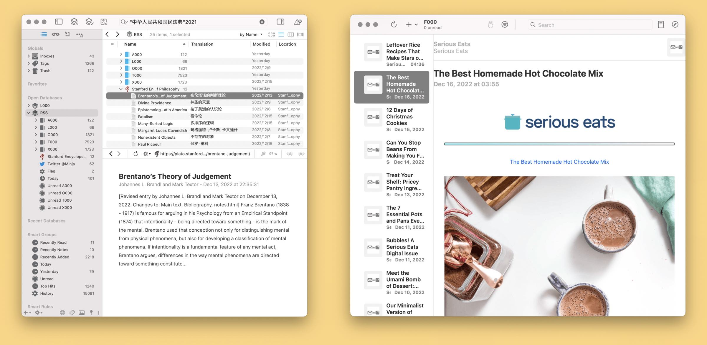

RSS 阅读器几乎是解决信息过载或者信息茧房问题的标准答案，有时候还会上升成政治正确。但管见以为，使用 RSS 阅读器只是治疗——很可能只是缓解——信息爆炸的第一步，如果没有后续行动，那就像跑完步之后大吃大喝一样，不仅可能功亏一篑，甚至还要开倒车。我试着从 RSS 阅读器遗留的问题开始，谈一谈信息源头为何必须分割，并且以不同的工具——在本文的语境下就是两款 RSS 阅读器——分而治之。

不管您正打算尝试 RSS 阅读方案来对抗社交媒体信息爆炸问题<a href="https://utgd.net/article/9896#footnote-fn-1" aria-describedby="footnote-label" data-footnote-ref="" id="footnote-fnref-1">1</a>，还是已经使用多年 RSS 却仍觉芒刺在背如鲠在喉，那不妨继续阅读本文。

多数人，尤其是近几年开始使用 RSS 之士，几乎都是社交网络的受害者——或至少自以为是受害者。人们抱怨社交网络，人们抱怨分享点赞，人们抱怨算法推荐，然后想当然认为相比之下“三五”的 RSS 订阅是人间正道。

但任何尝试 RSS 订阅的人，马上会遇到帕金森琐碎定律：通过使用 RSS 节省下来的时间，总会用于订阅更多的 RSS 订阅源，最终你看到的信息可能更多，往往还比原先更累。

但 RSS 本身并没有责任。客观地说，RSS 本来就不是专门为了读文章而设计的，从一开始，RSS 就只是一个通用的信息发布方式，并没有局限于文章。例如，国内外相当一部分高校都提供了 RSS 订阅，作为“校训通”平台，发布停水停电、催促缴费、课表变动等琐碎事项。再如，近几年 RSS 复兴的浪潮——或许只是余波——中，更多媒体形式也搭上了 RSS 渠道，微博、推特都有人尝试将其 RSS 化；文刀在[会员栏目](https://utgd.net/article/9380)中，也曾介绍过一种用 RSS 订阅视频更新信息的思路……可以说，你越是认为 RSS 很重要，越是把它作为抵抗信息过载的主要武器，那么你的 RSS 订阅列表必然积重难返。

很大程度上，RSS 只是一道更宽敞的水渠或车道更多的马路，但经验告诉我们，这些都不是解决拥堵的良方——如果您正在堵车的路上阅读这篇文章，想必感同身受。问题在于**信息源本身**，而 RSS 将各路信息统一一处的做法，恰恰加剧了堵塞。在这个意义上，我认为 RSS 不是信息过载的解药，而是一种麻醉药。RSS 治标不治本，因为它不能为信息分类。

## 区分娱乐性阅读与理解性阅读

疏通管道不如清洁源头。对信息的区分固然因人而异，但在一个世纪以前的一种分类标准，或许至今任放之四海而皆相去不远。这就是**娱乐性的信息**，以及**理解性的信息**，此二分法可救 RSS 之过载。

这一分法来自两本著作，分别是《如何阅读一本书》和《娱乐至死》，两者都久经读者考验。半个世纪前，随着识字率的上升，以及印刷工业逐渐普及，美国人遭遇了与我们今天类似的信息爆炸问题，《如何阅读一本书》应运而生，作者提出了娱乐性信息以及理解性信息的区分，从大面上把阅读行为一分为二：一类只想知道更多的事情，另一类则是理解它们。后来波兹曼在《娱乐至死》中一针见血地指出，娱乐性信息就是那些和生活脱节的信息，这不仅对印刷时代的阅读做了总结，还预告了信息时代的阅读范式：**娱乐和理解两分。**

有必要澄清，我不反对把阅读当作娱乐，事实上我本人也需要消遣，只是娱乐和理解应当分开。问题在于，多数 RSS 阅读器并不区分娱乐和理解，甚至把所有的阅读都变成了娱乐。比如，Inoreader 会显示文章的火爆指数，把自己变成了 RSS 服务中的 YouTube，玩起了数字和社交套路；有些阅读器在滚动屏幕的时候，会自动把滑过的文章标为已读，这完全是闯关游戏中金币自动收集机制的再现。游戏属性与社交元素完美的结合在一起，就像炸鸡配啤酒，得出的答案只有一个，那就是娱乐。

在传统 RSS 阅读工具或方案中，想静下心来阅读，如同要求一个人在逛街时研读哲学书一样困难。

理解性阅读工具与娱乐性阅读工具

应对技术带来的问题，唯一的方法就是使用另一种技术。RSS 只是推迟了信息过载的问题，解决之道或许是第二个 RSS 阅读器。这一方案有两种程度的实现：一种是比较浅层次的，单纯分开两类信息，因而对第二款阅读器的要求不高，如果止步于此，也就不成文章了；另一类则是膏车秣马，对理解性信息准备专用工具。

我并没有从一开始就作出娱乐-理解信息的两份，相反，首先是不知不觉同时使用了两款 RSS 阅读器。就像文章前半部分所指出的，我也是一个 RSS 重度用户，但很快，我发现严肃的学术文章和扎实的实务指南并不适合与花边消息杂在一块。有意无意之中，我把这些与专业和学业高度相关的订阅源移至别处，即一款很朴素的 RSS 阅读 NetNwesWare；至于那些读了开心、不读也无所谓的信息，则继续在 Reeder 里消费。这个无意识的转变已经暗示着我后来把 DEVONthink 引入阅读流程。

分离本身就是 leap，接下来的步骤不必分离简单，但或许更重要。一旦意识到有相当一部分内容需要分离，进而对接严肃阅读，一系列后续需求就接踵而来：比如说过滤，把无关内容撇出去，然后把重点关注的话题揪出来；再比如说翻译，一些很好的外文文章，需要把他们[对照翻译](https://utgd.net/article/4991)一下，方便阅读；至于批注、高亮、做笔记，以及全文检索等配套设施，也是缺一不可。这几乎是一个自我应验的预言，只有那些值得以理解为目的文章，才需要如此不恤物力，不惜人工；而那些兴师动众甚至卯足了劲儿去阅读的东西，基本上都和职业或学业高度相关。阅读的方式甚至还会改变所读内容的性质，有很多游戏和小说爱好者，真的把爱好当成嗜好认真对待，而不是草草刷过去就了事儿——这同样也是理解性的阅读。当然到了这种程度，自然也需要更好的阅读工具了。

至于第二款 RSS 阅读器为何是 DEVONthink，只是水到渠成。我一直在使用 DEVONthink 管理文件，它内置 RSS 订阅功能，自然而然地，我就把它变成了深度 RSS 阅读器，对接着后续的精读流程。理论上其他的文件或图书管理工具，只要配有 RSS，多少也可以替代 DEVONthink。我记得 Calibre 就有 RSS 功能，不过毕竟现有流程太复杂，我实在无力在在 Calibre 中重现，如果有读者能想到比较好的 DEVONthink 替代方案，希望不吝分享——毕竟，这玩意儿还是太贵了。

不少 RSS 阅读器和稍后读工具，其实也在往信息管理或文件管理的方向走，增添了大量传统电子书阅读器才有的功能，我不知道这些家伙来日如何，但理想的理解性 RSS 阅读器在世纪初就已成型：无非就是把文章保存到本地，然后用任何一款你喜欢的工具去阅读、批注、搜索、管理。

概言之，把需要严肃阅读、并且运用到工作与生活中的文章分离出去，然后继续在旧 RSS 阅读器中消费娱乐性资讯，就形成了两款 RSS 阅读器并存的局面。<a href="https://utgd.net/article/9896#footnote-fn-2" aria-describedby="footnote-label" data-footnote-ref="" id="footnote-fnref-2">2</a>

## 小结

从使用 RSS 阅读器的第一天开始我就知道，这绝对不会是阅读流程的终极解决方案，因为 RSS 阅读器只是把不同来源的信息汇集一处，但剩下的修行还是在于个人。还不知道 RSS 阅读器的年岁里，一个人反而不得不去诸网站或者软件浏览信息，娱乐和理解天然就能够分开；反而是使用了 RSS 阅读器之后，所有信息都混杂在一起，因而同时使用两个 RSS 阅读器，其实是找回了那种天然的分离状态。

说到底，两个阅读器，无非是在闹市与静斋之间降下一道竹帘；你可以随时穿过去，也不妨碍任何时候走回来。

___

1.  这篇文章的最高目标，是让所有 RSS 骑士都发现自己是唐吉诃德，向着不存在的敌人冲锋。 [↩](https://utgd.net/article/9896#footnote-fnref-1)
2.  考虑到已经有人用 RSS 订阅视频更新，如今的 RSS 阅读器不如叫“RSS 更新提醒器”，囊括了各种内容，因此同时使用三个甚至更多 RSS 客户端也合理。 [↩](https://utgd.net/article/9896#footnote-fnref-2)
