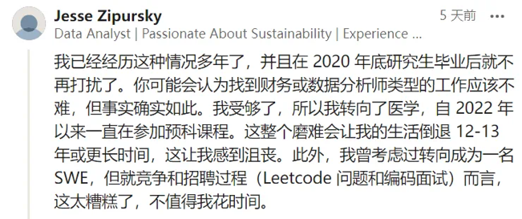

## 未来加速到来，人类面临危机

最近，Open AI宣称通用人工智能近在眼前，奇点已经到来。中国的DeepSeek奋起直追，让国人也体验到人工智能的厉害。从诗歌小说，到行业咨询报告，从法律医学，到科学研究，似乎AI处处比人强大许多，悲观迷茫的情绪笼罩一切。目前我看到两种主要的悲观观点。

一是AI教父辛顿提出，随着AI发展，财富差距将迅速扩大：

> 我们谈论的是生产力的巨大提升。所以每个人都应该能获得更多的商品和服务，每个人都应该变得更好，但实际上情况可能并非如此。如果处理不当，他表示接下来发生的将是：
> 
> **生产力的巨大提升将为大公司和富人赚取更多的钱，从而加大富人和失业者之间的差距**。
> 
> 这主要是因为失业的人将失去收入，而那些掌控AI的人——即生产商品和服务的人——将在没有劳动成本的情况下，享受金融特权。

去年12月28日，L Rudolf L发布了 _Capital, AGI, and human ambition_，强调了AI对社会价值观念的冲击。他的核心观点如下：

> 能替代劳动力的AI，将迅速改变人类与非人类生产要素的相对重要性，这会**减少社会关心人的动机**，同时使现有的权力更加巩固。

人类劳动力被AI取代后的世界将：

-   金钱比以往在现实世界中能买到更好的结果。
    
-   人们的劳动比以往任何时候都缺乏影响力。
    
-   劳动致富变得几乎不可能。
    
-   在各国内部或之间，无法实现资本的根本性平衡。
    

也就是说，社会将由中世纪耸立的城堡与底层大量农奴构成：

AI将创造"算法封建主义"，科技巨头通过数据垄断获得超额利润，传统劳动者难以分享技术红利 。这意味着，在能替换劳动力的AI出现时，拥有大量资本的人将拥有永久性的优势。

他们将拥有比如今的富人更多的权力：假如自由体制（liberal institutions）依旧强大，他们不一定凌驾在人民之上，但至少是在物质和精神上将更有权势。而且没有新兴势力可以击败他们，因为现在资本可以轻易地转化为任何领域的「超人」劳动力。

此外，世界上掌握权力的机构，将不再有动力去关心人们，以维持或增长他们的权力，因为所有真正的权力都将来自AI。

往好里想，政治机构可能会捍卫自由人文主义价值观。比如令每个人都拥有普遍基本收入这类措施；经济保留以人为本的部分，也可能维持人们的购买力。

往坏里想，AI 亿万富翁拥有近乎无限且不受约束的权力，他们会成为永久的贵族阶层（就像那些有着最原始的封建统治的星际文明构想）。

阶级之间的权力差异可能会让现代人感到颤抖，就像现代人无法认同封建等级制度一样。\[1\]\[[https://nosetgauge.substack.com/p/capital-agi-and-human-ambition](https://nosetgauge.substack.com/p/capital-agi-and-human-ambition)\]

总而言之，自动化取代中产阶级工作，也许会形成一个"经济断崖"：中间层垮塌，顶层1%掌控AI系统，底层则从事低薪服务。

目前这个趋势似乎正在实现当中，比如《华尔街日报》也登出报道，目前计算机专业的工作机会正在萎缩。另有大量程序员上网发言，表示工作空前难找。

这些人的经历是否是特殊个案？

Indeed.com 数据显示：自2020年2月以来，软件开发类职位的招聘需求下降了30%以上；

Layoffs.fyi 数据显示：今年美国有451家科技公司裁员，科技公司已经裁减了约13.7万个职位，聘雇率也是10年来最低；

Pequity 数据显示：互联网科技行业2024年的薪资增长基本停滞不前，与去年相比，平均薪资仅增长了0.95%，自2019年以来，中型软件公司的入门级职位的股权授予平均下降了55%。

至于科技行业的非技术岗，比如市场营销、人力资源、销售、财务等，相比程序员更是被裁员多轮。当公司发现可以用更低廉的外包实现岗位职能时，何必还“养”全职员工呢？

面对这种情况，正如 James O'Brien 教授所说：

> AI 最终将接管大部分工作，与其争论它接管工作的确切时间是两年还是二十年这样的辩论，我们不如更有效地去思考如何适应和在人工智能系统越来越繁荣的世界中（这往往以牺牲人类的工作为代价），我们该怎么办？

## 未来画面虽十分灰暗，但这不是唯一可能

替代人工只是一种副产品，不是任何一种技术的最终目的。历史上发生的每一轮技术革新都是为了创造更多财富，开拓更广阔的疆域，如果这一点能实现，旧岗位消失这种副产品，最终均被更大范围的生产活动吸收。

那么AI 除了淘汰人类分析师、出纳、初级律师、程序员、画师、小说家……似乎让人类劳动者无路可走之外，它到底还能有啥用呢？搞清楚这个问题，才能找到可走的路。让我们发挥人类的特有优势：类比思维、模糊模式识别，也就是创造力，来看看更全景的画面，以及人类可以在其中给自己找到什么位置。

1956年，阿西莫夫在《最后的问题》等一系列故事中，已经设想出超级计算机马尔蒂瓦克（Multivac，万用计算机的意思），其实也就是通用人工智能。它能搜集处理海量的数据，预测犯罪问题、纠正市场失灵、了解每个人的天资禀赋和最适合的专业岗位，回答人们海量的生活、情感、专业问题，是类似于GPT、DeepSeek的人工智能。

那么 Multivac 普及后的人类文明往何处去呢？Multivac 并没有将人类逼上灭绝之路，而是开拓了更大的生存疆域。帮助设计更先进的宇宙飞船，设定航线，帮人类登上了月球、火星和金星以及太阳系外行星。能源遇到了上限，地球资源无法支持更大范围的宇宙开发后，它帮助人类摆脱了地球资源如煤炭核能，而是将太阳能的储存、转化和利用提升到行星级规模，看描述类似于戴森球的空间站，地球不再需要化石能源，而是可以接入太阳能能量束。能源变得无限且免费。Multivac 作为一个有能力自主学习的通用智能，它的智能水平和数据量也在不断进化，不再只限于处理已知信息，而是可以与物理世界交互，做出新的发现。

还有费曼的“物理学家能做的事”：

_我们也可以从氢得到能量，不过现在还只是在爆炸和危险的条件下。如果它可以在热核反应中受到控制，那么可以证明，每秒从大约10升水中得到的能量就等于整个美国的发电功率，也就是说，每分钟用600升水，就有了足够的燃料来供应今天美国所用的全部电能！因此，该由物理学家想办法，把我们从对能量的需要中解放出来。这是可以做到的。_

今天的室温超导、可控核聚变，人工智能是否能缩短开发时间？还有哪些技术能帮人类获得极低成本的无限能源？这些活动，都是只有和世界直接交互才能实现的智能活动。

**AI 目前，还不能代替可以与世界交互的人类。我问GPT**：像你这样的人工智能，目前能否发现新问题？GPT回答：

其实我想问的不是识别患者数据中人类没发现的关联。而是范式改变层面的发现。1847年的维也纳，有一间产妇们拼命要避开的、死亡率高达20%的神秘产房，没有医生知道是怎么回事，AI 能否基于当时还完全不存在“微生物”概念的医学文献做出这样的回答：“因为医生解剖完尸体，直接去给产妇接生，没有洗手。手上存在微生物，致病菌感染了产妇，导致了产妇死亡。”

1847年，人类医生塞麦尔维斯，观察到同事科列奇卡进行尸检后不小心划破了手，很快发烧并死于败血症。症状与死于产褥热的产妇一样，于是他在黑暗中建立了一个关联：可能是第一病区的外科医生在病理科与产房之间穿梭，进行尸体解剖后直接去接生，造成了产妇的传染。而其他产房仅仅由护士照料，护士不会接触解剖，所以死亡率很低。于是他提出医生进产房前应该用氯化石灰溶液洗手，成功地将该产房死亡率下降了90%。

问题是，当时整个世界都还根本不存在“微生物”的概念，塞麦尔维斯当然也无法解释“传染”的具体机制。但他提出产褥热是“医源性”的疾病，冒犯了医生同行，使他失去了晋升机会，遭受大量打压精神抑郁，并在精神病院遭到毒打去世。和永远能够给出人类期待的答案，从而得到大量喝彩和财富的AI 不同，探索未知的道路总是通向黑暗，道路上充满了等待、才华的蹉跎浪费、斗争与孤独。

从“不知道自己不知道”，到“知道自己不知道一些东西”，这个过程付出过沉重的代价和痛苦。科学探索当然没有停留在200年前。现在的AI 给我们感到一问题都能得到轻松快乐的答案，这是文科寻章摘句的状态，而非探索新知的状态。即便在今天，99.99%以上的世界仍然停留在未知的黑暗中。比如最近刚刚过去的一轮大流行，全球死亡了六百多万人。我们每个人都认识一些深受影响甚至失去生命的人。我们总以为今天的科学已经无比厉害了，但是，即便是今天的科学水平，也还是无法解决流感、肺炎这些“小事”。

《细胞传》中，穆克吉这样评说大流行，以及在真实世界中进行科学探索面临的不确定性：

_病毒为何，或者如何，导致“免疫失调异常触发”？**我们不知道**。它是如何操控细胞的干扰素应答的呢？虽然存在一些线索，**但尚无确切的答案**。免疫应答发生的时机，即早期阶段的损害与随后晚期阶段的过度活跃，是主要问题所在吗？**我们不知道**。那些在感染细胞中检测到病毒蛋白片段的T细胞起什么作用呢？它们能在一定程度上避免严重的病毒感染吗？有证据表明，T细胞免疫可以减轻感染的严重程度，但是其他研究并不支持这种保护程度。**我们不知道**。为何病毒在男性中引发的疾病比在女性中引发的更严重？同样，虽有一些假设性的答案，**但我们并没有确切的答案**。为何有些人在感染后会产生强效的中和抗体，而其他人却没有呢？为何有些人会在感染后出现长期的后遗症，包括慢性疲劳、头晕、“脑雾”、脱发与呼吸困难等一系列症状呢？**我们不知道**。_

**_千篇一律的回答让人感到惭愧与沮丧。我们不知道。我们不知道。我们不知道。_**

_大流行教会了我们流行病学的知识，同时它们还教会了我们**认识论的概念：我们如何了解我们所知道的内容**。新冠病毒迫使我们把最强大的科学力量集中在免疫系统，这个细胞社群及细胞之间传递的信号受到了可以说是有史以来最严格的审查。**但或许我们对新冠病毒的理解仅限于我们现有的免疫系统知识，也就是我们已知的已知(the known knowns)。我们无法洞察未知的未知(the unknown unknowns)**。_

_或许这场大流行揭示了我们**认知上的另一个差距**：或许其他病毒也会像新冠病毒一样，以意想不到的方式来影响免疫系统的细胞，使其产生致病性，而我们只是忽视了这些更深层次的解释（事实上，我们已经知道巨细胞病毒或EB病毒等病毒中存在这种机制）。**关于新冠病毒为何如此狡猾地劫持了我们的免疫系统，我们自认为了解的故事或许根本不完整。我们对于免疫系统真正复杂性的理解又部分回到了原点。**（也许AI未来可以在潜在关联上提供更多备选方向，但故事本身从无到有的第一步框架性构思，还需要人。）_

_科学始终在追寻真理。在扎迪·史密斯的某篇文章中有一个令人难忘的画面，内容是一幅查尔斯·狄更斯被其所创作人物环绕的漫画：胖子匹克威克先生穿着不合身的马甲，热爱冒险的大卫·科波菲尔戴着高顶礼帽，还有衣衫褴褛、天真无邪的小耐尔。_

_史密斯是在描述作家，特别是小说家完全投入自己创造的角色的思想、身体与世界时所经历的超然感受。这种熟悉或亲近感仿佛就是一种“真实”体验。史密斯在提及那幅漫画时写道：“狄更斯看起来并不担心，也不感到羞愧，似乎并没有怀疑自己可能患有精神分裂或其他疾病。他为自己的状态起了一个名字：小说家。”_

_现在让我们去想象另外一些角色，它们周围环绕着某种模糊的光环。其中一些“角色”，例如1型干扰素、Toll样受体或中性粒细胞，大部分能够被我们发现，但是它们处于若隐若现的光线中。**我们以为自己知道并且了解它们，但实际上并非如此。有些只是投下阴影，有些则是完全不见，有些会误导我们对其身份的认知，而且周围还有其他我们几乎无法感知的存在，我们甚至还没有见过它们，也没有给它们命名。**_

**_我也为探索这些奥秘的人起了一个名字：科学家。我们观察，我们创造，我们想象，但即使是对那些可能通过自己的工作（部分）发现的现象，我们也只能找到不完整的解释。我们还是无法深入理解它们的本质。_**

_新冠病毒感染揭示了与我们周围各种角色共存所需的谦卑态度。我们仿佛史密斯笔下的狄更斯，**但围绕我们的是阴影、幽灵与谎言。正如一位医生告诉我的那样：“我们甚至不知道有哪些事情自己不知道。”**（《细胞传》）_

从“不知道自己不知道什么”，到“知道自己不知道什么”，这些人工智能目前还做不到，目前的人工智能仍然是在依据人类研究出来的文献和数据，来推测可能的关联。如果没有人类研究积累的庞大金库储备，它无法从空气中炼出知识黄金来。

这里面的关键差别是能否发现“不知道”什么。同样面对“大流行”现象，而没有专业知识的人，能提出什么问题呢？除了情感体验，几乎没有问题可提。发现“不知道”，必须掌握专业知识。如果连问题都提不出来，又如何去解决？

**什么是理性？发现一个本来似乎不存在的问题，再寻找前往的路径。目前，理性，仍然是人的高地。**

教育、家庭需要思考的问题，是我们在将孩子往理性主体的方向培养还是碳基机器人的方向培养。

那么AI 能否做理性做的事呢？于是我又更细化了问题：AI 能否发现物理实体界的新问题，但在文献中还没有形成趋势的？

GPT这样回答：

AI在做的是更好地发现异常、识别模式、探索超出人类直觉的变量组合、以及跨学科整合，但这些仍然基于已有的数据。

因此，需要认真思考的一个问题是：为什么之前由人类付出如此之大的代价研究出来的知识和数据的知识产权却可以白白使用？成为科技公司的利润，并让人类失去收入？如果尊重知识产权，就能给知识生产者带来收入了，而不是免费使用人类代代积累的知识金矿，却只让科技公司挣钱，这是掠夺不是吗？

知识从无到有被发现是怎样一番情景呢？是颠覆性的、因而也常常是冒犯的，是“不知道自己不知道”的迷茫和痛苦，而不是什么都知道的自满状态。阿西莫夫的Multivac、带领地球流浪的MOSS、GPT、Deepseek或任何AI，**真正向智能体迈进的标志不是对已有文献进行搜集整理和复述，**不是只提供能够提供符合用户期待、令顾客开心的答案，**而是要有能力提出“目前还不知道的东西”。**

阿西莫夫《最后的问题》中的AI，具备独立认知能力之后做了什么呢？帮人类实现了向宇宙扩张的目标。作为人工智能，没有生物自我复制和扩张的本能欲望。而作为生物，生存、发展、壮大却是人的最强烈的本能欲望。如果没有人类自身的意愿，人工智能就不会帮助人类去实现“超空间飞行“，使得人类可以前往其他恒星系，殖民整个银河系，乃至数亿年后繁衍遍及整个宇宙。这些点子看似遥远，但揭示的想法却与当下实际相关：**怎样的AI 可以算是真正的智能？不论是人这样自然的智能，还是人造的智能，首要的功能是与真实世界交互，扩张生存空间，而不仅仅是存在于文献数据的数据世界，抢夺有限的蛋糕。** 但要向外拓展生存空间，最重要的是人自身的意愿和想象力。

真的会如马斯克所说，80年后会有100万人跨星际生存吗？

先不说星际殖民，目前值得探索的，涉及人类生存和发展的问题就有：攻克癌症、攻克新冠、流感等大流行病、寻找自闭症等疾病的基因位点和发病机制、“治愈”衰老病如阿尔茨海默病甚至治愈“衰老”本身、室温超导、可控核聚变、控制与逆转气候变化、塑料垃圾处理、量子计算大规模应用等等。如果能成功攻克此类新领域，人类会攻克新的大陆，扩展生存空间，新的职业和岗位会自然产生。生存空间的扩张看似遥远，但20年前谁又能想到通用人工智能的奇点可以这么快到来呢？假如可以开创出全新生存空间，几百上千亿人口都不算多。

## 人应该如何适应新的环境，参与价值创造？

AI 表示，在人类与AI 协作的新图景中，人类的角色是提出问题、提出假设、构建理论和实验验证。这不就是我们讲的“明辨式思维“（Critical Thinking）的步骤吗？这也是人类认知的基本步骤。但人的基本认知机能，并没有得到很充分的发展。今天的教育仍然像前现代的小农经济，处于十分低效粗放的刀耕火种阶段，没有足够的资源因材施教，只能牺牲个体差异，整齐划一。在严肃训练和个人特点之间做徒劳的取舍，而更大的数据分析能力可以突破这个虚假对立。从教学资源、一对一辅导到考核筛选，都可以对每个人做到更大资源投入和更大数据收集、评估分析和定制。

原始粗放的教育模式，产出的是粗糙的教育产品——没有真正被激发全部潜能的人类头脑，一分神性、两分动物性、七分机器人性。我们惯常认为只有钢铁的、电子的机器，才会缺乏自我意识和理性——发现自身的目的性并自主规划达成路径，只有机器才被动执行指令。

然而，审视一下自己，碳基智能中的绝大部分，大部分时间，似乎也只是在机械性地执行指令，而没有意愿和能力提出问题。前面穆克吉对大流行提出的一连串问题，为什么我提不出那些问题？因为我没有相关知识体系，没有知识体系，就无法发现未知的前沿在哪里。

没有达到意识觉醒的碳基智能不同程度上也属于机器。在这个新场景中，人需要自我进化，获取理性能力。催眠教育中搭建的、不明所以的“知识体系”不如别费那个劲。要学习就要真的学习，主动思考、自主关联，不断去构想解释框架、在实践中验证并更新框架，主动学，做中学。学习不仅仅是学内容，新的图景中，更重要的是学习如何从无到有搭建知识体系，自主学习能力要从小培养。像人一样带着热情和想象力去学习，而非碳基机器人一样被动催眠式灌输学习。升级为理性人，具备自主的知识体系，提出问题，驾驭AI，才能避免和AI 零和博弈。

## 人有人的用处

**人类学习如此艰难缓慢，代价如此昂贵，为什么还要费那么大力气学习呢？**

阿西莫夫还有一篇后AI 时代的诙谐故事。以前看笑他太疯癫，现在轮到他笑我看不穿。

这篇 _The Feeling of Power_《能力（Power是能力也是权力））的感觉》同样为1950年代的作品，描写了在人工智能发明之后很久远的未来，两军交战。由于交战双方一切都自动化了，从武器研发、导弹路径、战略战术、都严重依赖计算机，双方算力相当，模拟水平相当，我预判你的预判我的预判，导致战况进入僵局。当然，你也可以把战争替换为投资、产品设计等不同博弈场景。将军、科学家，全都一筹莫展，直到一名工程技师拿出一个独创性的、石破天惊的发明：竖式计算。

_现场陷入了沉默。片刻之后，韦德将军说：“我不相信。他说了这么多，写了这么多数字，又是乘法又是加法的，但我就是不信。它太复杂了，不可能是别的，只能是骗局。”_

_“哦，不是的，长官。”奥布紧张得汗都下来了，“因为你还不习惯，才会觉得复杂。实际上，规则相当简单，而且能用于所有的数字。”_

_“所有的数字，嗯？”将军说，“那好吧。”他拿出自己的计算机（一个更为高级的型号），随意按了几下：“在纸上写五七三八，五千七百三十八。”_

_“是，长官。”奥布说。他翻到了新的一页。_

_“现在，”他又在计算机上按了几下，“七二三九，七千二百三十九。”_

_“是，长官。”_

_“把这两个数乘起来。”_

_“需要点时间。”奥布颤声说道。_

_“不急。”将军说。_

_“开始吧，奥布。”舒曼干脆地说。_

_奥布弯着腰开始计算。他用完了一张纸，又拿了一张新的。将军终于掏出自己的怀表看了一眼：“你完成你的魔术了吗，技工？”_

_“就快了，长官。算出来了，长官。四千一百五十三万七千三百八十二。”他展示了那一长串潦草的数字。_

_韦德将军冷笑了一下，按下自己计算机上的乘法符号，等着数字跳动着最终停了下来。随后，他瞪大了眼睛，发出惊声尖叫：“我的银河系啊，这家伙算对了。”_

_…_

总统质疑了，手动在纸上计算加减乘除如此之艰难缓慢，人类学数学计算有什么用？面对这种质疑，主张重新发明数学的一方提出：

_刚出生的婴儿又有什么用呢，总统先生？现在它还没有用，但你没看到它指明了摆脱机器的方向吗？好好想一下，总统先生。”议员站了起来，深沉的嗓音自动添加了他在演讲时的抑扬顿挫，“德尼比安战争是计算机对抗计算机的战争。他们的计算机铸造了一条无法突破的防线，用反导系统阻挡了我们的导弹，而我们的计算机也铸造了同样的防线来对付他们的导弹。要是我们提升计算机的效率，他们也会提升他们的。因此，在过去的五年之中，这种状况形成了危险且无益的平衡。_

_“现在，我们掌握了一种不需要计算机的办法，能超越计算机，把它们甩在后面。**我们将统合机械计算与人类的思维。我们将拥有等同于智能计算机的东西，有好几十亿个呢。** 我无法预计具体会有什么样的结果，但肯定难以估量。如果德尼比安在这方面领先了，其后果将是灾难性的。”_

这个故事看似荒诞，但其实十分实际，直刺今天我们的痛点：**AI 什么都比人强，人还要学习任何技能吗？**

Deepseek是免费的，人人都可以使用。在此刺激下，GPT也开放了免费使用。一时间，大家目不暇接。Deepseek太会写文章了！太会写诗了！它还会写报告，还会心理咨询。第二步发展是，我什么都不用做了，AI 可以替我做。第三步发展是，员工被辞退了，所有的老板都用上了AI，写出了一样水平的小说，做出了极其类似的产品、行业报告、走势预测。这时候，曾经被放弃的人类知识体系和理性思维能力，成为有可能打破僵局的力量。

**因此，在AI 看似什么都比人强的情况下，反而人类学好数学、语言、明辨式思维的迫切性，比以往更甚。**

**好消息是，在AI 的帮助下，任何人都可以比以往更容易学好。剩下的只有是否愿意的问题。**

仅仅这几天，已经发现AI 在两道孩子的数学题上胡说八道。你们也可以用孩子不会做的数学题去问AI。小学数学题还在我们自己的知识范围内，那么其他问题呢？在AI 并不披露信息来源的情况下，如何检查AI 说的是否可信？包括信息来源和推理过程，有没有出现“没有批准该客户贷款申请，因为他的手机电量不到17%”之类的算法黑箱。会不会被利益集团“对齐”？任何博弈场景，都可能出现小说中这种两国交战的态势，需要人类自身具有基本的思维能力去做突破，而思维能力脱离知识体系是无法单独存在的，因此人不能放弃自主知识体系搭建。

AI 这么会思考会分析了，我还要学习如何思考问题吗？空前需要，否则你无法辨析真伪和拿出差异化方案。

计算机的计算速度和准确性，是人无法企及的，小学生为什么还要苦练计算？

因为如果没有计算功底，你就无法自主识别自然之书隐藏的规律。不理解自然，你就提不出问题去扩展自己的生存空间。

AI 降临后的人类，空前需要真正的理性能力，如何识别思考目标，如何自主搜集和查证资料，如何建立分析框架、组织事实和数据支撑，并验证或证伪框架。这些能力没有人生来就有。人类也有很强的工具属性，生来不过是传递基因的工具，进化积累的身体和心智指令是我们的程序，条件反射是补充条款。有AI 之前，很多人没有条件，或者自动放弃理性这种十分精妙，但对生命存续而言代价昂贵的奢侈品。有AI 之后，有意愿的人，更容易从碳基机器人的低觉醒、高套路，进化到人的高觉醒、高自主性的理性人。AI 会进一步放大工具人和理性人的差距。

有AI 之前，优质学习资源稀缺、师资匮乏普遍存在。为追求品质保障，人才流水线最高效的选择是以单一尺度衡量和削足适履。而实验性教育，却难以解决师资水平参差不齐的问题，很难复制成功个案。因此，AI 之前，个性化、深度一对一学习方案定制和教练方案极为昂贵，几乎不可能大规模实现。但现在有了AI，真正可以以极低成本，实现一对一定制式教育。在AI 免费教练的帮助下，你可以了解自己的禀赋特性，探索你所不知道的深度学习资源，你可以尽情提问，自学任何内容。不用担心被老师个人水平限制，不用担心补课费、不用担心丢脸浪费全班人时间，可以一直问AI 直到自己真正理解为止。

这是最坏的时代，也是最好的时代。一方面，辛顿等悲观主义者警告的科技封建主义前景确实可能出现；另一方面，希望之门从来不会彻底关闭，新的智能将帮我们前往星辰大海这一科技乐观主义同样可能实现。是否用AI 来培育理性与自由意志，将自己升级为理性人，决定权在每个人自己，而不在别人手中。

\- END -
