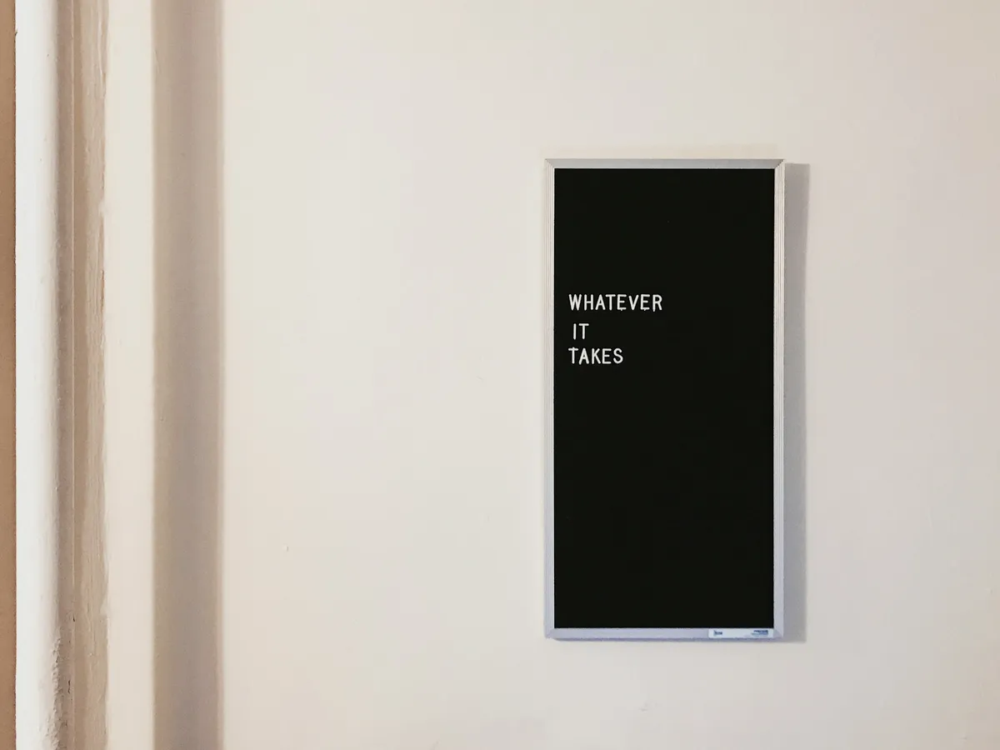

[## So!azy](https://blog.solazy.me/)

[Home](https://blog.solazy.me/) [Daily](https://blog.solazy.me/Daily/) [Article](https://blog.solazy.me/Article/)[About me](https://blog.solazy.me/about-me/) [RSS](https://blog.solazy.me/feed/)

## 慢下来，探寻「时间卖多份」的可能性

_2025-03-03_

前两天在网上刷到一个说法，大意是要多多发展副业，这让我不由得回想起了自己这几年的经历。从几年前从阿里巴巴离职后，我就刻意放慢了职场的节奏，选择了一个压力没那么大的平台，回归到一种更慢的生活步调。当时的初衷并不是为了追求所谓「更好享受生活」。我其实不是一个特别会享受的人。我是想把重心从工作转向生活本身，去探索更多的可能性。我希望能在这些可能性里，找到一个我真正喜欢、热爱，或者至少能让我保持足够热情的副业。

这些年，我尝试了不少新鲜事儿。比如，我喜欢在大街小巷里寻觅那些不起眼的苍蝇馆子，感受不同的味道和故事。我也利用业余时间做了一些内容。我不太愿意直接称它为「自媒体」，总觉得这个词有点被用滥了。我甚至还和朋友一起合作运营了一个 B 站账号，关注量后来居然突破了百万。这些尝试对我来说很有意思，但我并不强求每件事都要一直做下去。很多时候，我更享受的是探索的过程，而不是非要把它变成一个固定的事业。

想到这里，我脑海中又浮现了蔡康永多年前的一个观点。具体是哪次节目我记不清了，可能是《奇葩说》之类的地方。他提到过一个想法，大概是「要把时间变成可以被复制的」，或者更直白点，「要把时间卖多份」。他的意思是，每个人的时间都是有限且均等的。如果只是按部就班上班，等于把时间单一地卖给了公司，被公司「垄断」了，没法再重复利用。但如果你能用一段时间创造出一些东西，比如写一套软件、一本书，或者其他什么作品，卖出一千份，就相当于把你的时间卖了一千次。这种方式带来的收益，也就是所谓的「睡后收入」，不需要你持续投入时间。哪怕你在睡觉，它也能继续为你赚钱。

这个观点其实特别打动我。我反思了一下，觉得自己这些年一直在寻找的，可能是「时间卖多份」和「从生活中发展副业」这两者之间的结合点。对我来说，一个理想的副业不应该是那种需要持续消耗时间、而且一段时间只能换来单一收益的东西。如果是那样的话，它就和上班没什么区别了，顶多换了个形式而已。我想要的，是可以用一段有限的时间，创造出某种能持续产生价值的东西。这里的「价值」不一定非得是钱，也可以是更深层次的意义，比如内心的满足，或者对别人的影响。

举个例子，我做内容的时候，可能会花几天甚至几周去准备一篇文章或视频。但一旦发布出去，它就可能在很长一段时间里被反复看到，甚至引发讨论。这种感觉就有点像蔡康永说的「时间卖多份」。反过来，如果一个副业需要我每天花几个小时盯着，产出却只能线性增加，那我可能就不会太感兴趣。因为对我来说，副业的目的不是让自己更忙，而是让我在有限的时间里，找到更多生活的可能性。

当然，这些想法还在摸索中。我还是会继续尝试新鲜事儿，也会继续思考，到底什么样的副业能真正契合我的期待。或许答案不是唯一的。但这个过程本身，就已经挺有意思了。

[#daily](https://blog.solazy.me/blog/?q=daily)
