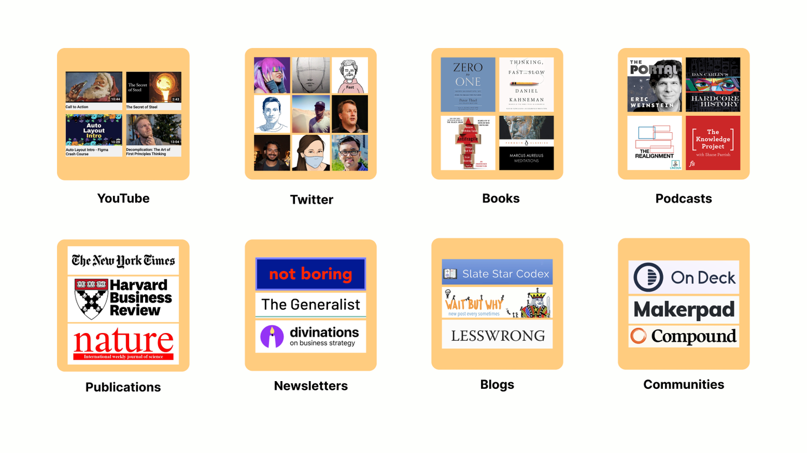
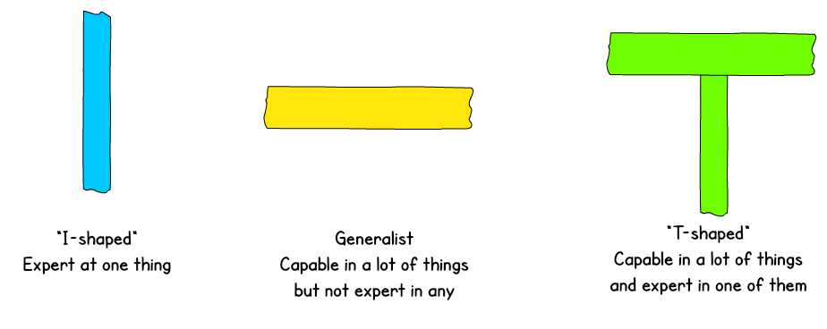
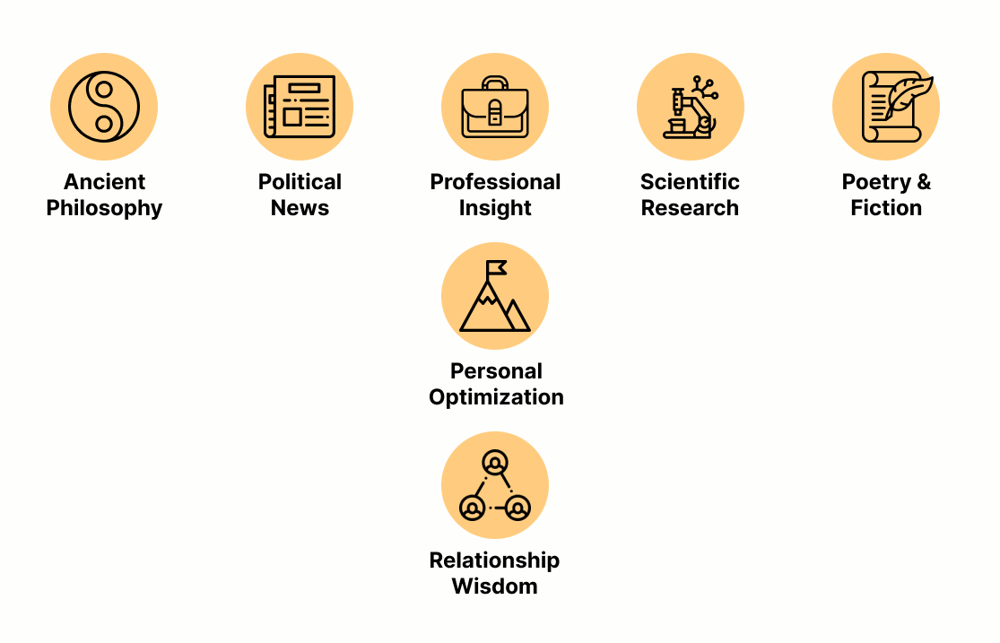
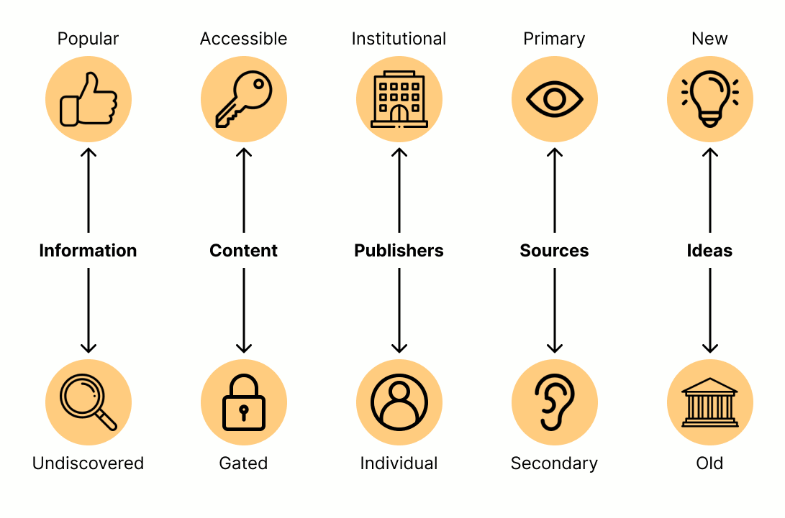

[](https://substackcdn.com/image/fetch/f_auto,q_auto:good,fl_progressive:steep/https%3A%2F%2Fbucketeer-e05bbc84-baa3-437e-9518-adb32be77984.s3.amazonaws.com%2Fpublic%2Fimages%2F273dedff-46a6-4218-869c-fa4ac9dc222c_604x604.jpeg)

Untitled by Dan Walsh  无题 作者：丹-沃尔什

_Welcome back to [The Jungle Gym](https://nickdewilde.substack.com/) – a newsletter to help you build a more fulfilling career by integrating work with your life.  

欢迎回到  [丛林健身房](https://nickdewilde.substack.com/)  --这是一份通过将工作与生活相结合来帮助你建立更充实的职业生涯的时事通讯。_

_If you're new here, check out [this introductory post](https://junglegym.substack.com/p/welcome) to learn what The Jungle Gym is all about, or [search through the back catalog by topic](https://www.notion.so/junglegym/The-Jungle-Gym-Deconstructed-a825bdecb778464eb873ca67d5fde6e1).  

如果您是新读者，请查看  [这篇介绍性文章](https://junglegym.substack.com/p/welcome)  了解《丛林健身房》的内容，或[按主题搜索后面的目录](https://www.notion.so/junglegym/The-Jungle-Gym-Deconstructed-a825bdecb778464eb873ca67d5fde6e1) .。_

_To get future issues delivered to your inbox, enter your email here:  

要将以后的期刊发送到您的收件箱，请在此处输入您的电子邮件：_

Here's a quick summary of what this issue will cover:  

以下是本期内容简介：

🔎 **The T-Shaped Information Diet**  

🔎 **T 型信息饮食**

Learn how to curate information streams that consistently deliver high-value insight.  

了解如何策划能够持续提供高价值洞察力的信息流。

-   ☁️ How to let go of career aspirations  
    
    ☁️ 如何放下职业理想
    
-   ⚒️ How skills diffuse  ⚒️ 技能如何扩散
    
-   🎓 Building intellectual legitimacy  
    
    建立知识合法性
    
-   🇺🇸 Solving America’s leadership crisis  
    
    🇺🇸 解决美国的领导力危机
    

Somewhere out there is an idea that could change your life, like:  

在某个地方，有一个想法可以改变你的生活，比如：

-   The marketing experiment that could 10x your company’s growth trajectory  
    
    能让公司增长轨迹翻 10 倍的营销实验
    
-   The investing tip that could make you a centimillionaire  
    
    能让你成为百万富翁的投资技巧
    
-   The health habit that could add a decade to your lifespan  
    
    能让你的寿命延长十年的健康习惯
    

There’s just one problem; you haven’t encountered that life-changing idea. Not yet, at least.  

只有一个问题，那就是你还没有遇到改变人生的想法。至少现在还没有。

The best way to discover it is by getting intentional about the inputs that make up your information diet.   

发现它的最佳方法就是有意识地输入信息，以构成你的信息饮食。

[In the words](https://www.youtube.com/watch?v=rC13mXUORBs&ab_channel=PolinaMarinovaPompliano) of _Atomic Habits_ author James Clear:  

[用 _《原子习惯》_ 作者詹姆斯-克利的话说：](https://www.youtube.com/watch?v=rC13mXUORBs&ab_channel=PolinaMarinovaPompliano)

> _I find that almost every thought I have is downstream from what I consume. If you have better inputs, you naturally get better outputs.  
> 
> 我发现，我的每一个想法几乎都来自于我的消费。如果你有更好的输入，自然就会有更好的输出。_

To get better inputs, you’ll need to subscribe to some high-quality information streams.  

为了获得更好的输入，你需要订阅一些高质量的信息流。

[](https://substackcdn.com/image/fetch/f_auto,q_auto:good,fl_progressive:steep/https%3A%2F%2Fbucketeer-e05bbc84-baa3-437e-9518-adb32be77984.s3.amazonaws.com%2Fpublic%2Fimages%2Fec0b11c9-c937-4973-84b7-3da4b0a7778f_1456x819.png)

But not just any information stream will do.

Our attention spans are finite, which raises the opportunity cost for subscribing to any given source. The challenge is to weed out sub-optimal information streams to make room for those that consistently deliver valuable insight.

This essay will cover some principles you can use to cultivate a high-quality information diet to capture the benefit of more life-changing ideas.

The T-shaped talent model suggests that the best way to grow your abilities is to build a shallow understanding across a breadth of domains and a depth of expertise in whichever domain is most relevant to your profession.

[](https://substackcdn.com/image/fetch/f_auto,q_auto:good,fl_progressive:steep/https%3A%2F%2Fbucketeer-e05bbc84-baa3-437e-9518-adb32be77984.s3.amazonaws.com%2Fpublic%2Fimages%2F8569a99a-8d31-44ba-8236-5817afde7021_924x368.png)

This same lens helps identify which topics to prioritize within your information diet.

To build the vertical bar of your T, you’ll want to subscribe to information streams that help you perform the important roles and responsibilities you’ve signed up for in your personal and professional life. 

Here are a few of the key roles I play:

-   Product Marketer
    
-   Newsletter Publisher
    
-   Husband
    
-   Self-Maintainer
    

To be effective in those roles, I need to ensure my information sources contain insights that help me perform.

For example, in my role as a product marketer, I sell a workforce education platform to HR leaders. Accordingly, I tap into domain-specific information streams that bring me:

-   **Insight about marketing** from influential writers like [Rory Sutherland](https://twitter.com/rorysutherland) and [Julian Shapiro](https://twitter.com/Julian).
    
-   **Perspective on education and employment** from publications like [Emsi](https://www.economicmodeling.com/blog/) as well as thinkers like [Michael Horn](https://twitter.com/michaelbhorn).
    
-   **Understanding of the HR function** from thought-leaders like [Josh Bersin](https://twitter.com/Josh_Bersin) and communities like [The Institute for Corporate Productivity](https://www.i4cp.com/).
    

By mapping out your personal and professional responsibilities, you should get a good idea about which topics the vertical bar of your information diet should include. 

The real magic comes from selecting the sources for your horizontal bar.

These can come from a broad range of domains, including:

-   Ancient Philosophy
    
-   Politics
    
-   Scientific Research
    
-   Fiction
    

While these sources may seem less consistently relevant to key roles you play, they will help generate unique and creative approaches to the challenges encountered over the course of your work and life.

As a marketer, I have benefited by incorporating information sources that other marketers don’t, including:

-   Eric Weinstein’s podcast covering the [distributed idea suppression complex](https://podcasts.apple.com/us/podcast/18-slipping-the-disc-state-of-the-portal-chapter-2020/id1469999563?i=1000462651162)
    
-   Joseph Henrich’s books about [cultural learning as the key to human success](https://www.amazon.com/dp/B00WY4OXAS/ref=dp-kindle-redirect?_encoding=UTF8&btkr=1)
    
-   Jordan Hall’s videos interpreting the paradigm shift [that’s transforming how we make sense of reality](https://www.youtube.com/watch?v=4wdmed9KgwI&t)
    

Your T-shaped information diet should fit the roles you play and the domains that interest you.

[](https://substackcdn.com/image/fetch/f_auto,q_auto:good,fl_progressive:steep/https%3A%2F%2Fbucketeer-e05bbc84-baa3-437e-9518-adb32be77984.s3.amazonaws.com%2Fpublic%2Fimages%2F2ea76316-ea6a-43da-a0d6-f931c3c5d993_1115x717.png)

As you seek out information streams, it can be tempting to go overboard subscribing to new podcasts and newsletters. Remember: your attention is finite--overburdening yourself with information isn’t the answer.

Just as a good diet isn’t judged by the quantity of food you eat, a good information diet doesn’t depend on how much information you consume. Your best bet is to select a smaller number of high-quality information sources.

In the sections ahead, we’ll cover some principles that will help you evaluate potential sources of information to add to your diet, including:

-   Popular vs. Undiscovered Information
    
-   Open access vs. Gated Content
    
-   Institutional vs. Individual Publishers
    
-   Primary vs. Secondary Sources
    
-   New vs. Old Ideas
    

Let’s look at how each of these principles contributes to the construction of a healthy information diet.

[](https://substackcdn.com/image/fetch/f_auto,q_auto:good,fl_progressive:steep/https%3A%2F%2Fbucketeer-e05bbc84-baa3-437e-9518-adb32be77984.s3.amazonaws.com%2Fpublic%2Fimages%2Fa87f22fd-54b5-4fe1-bf40-6b570500e32b_1091x721.png)

Imagine, back in 2013, you discovered a convincing explanation of why Bitcoin will be a trillion-dollar asset. Had you traded on that belief before most of the world had heard of cryptocurrency (and cashed out in 2021), you would have been rewarded handsomely.

Therein lies the value of an undiscovered information source. Because few people are tapping into it, you can gain by acting on it first.

But undiscovered information isn’t the only way to get an edge. There’s also an advantage in knowing things that others know.

For example, if you and your manager have both read the same book, you can reference it when collaborating. If your whole company has read the book, you can mention it in an all-company meeting to convey an idea to everyone.

In this way, widely accessible information has a network effect where each person with access to an idea can provide benefit to others who are familiar with it.

To access both of these advantages, you’ll want to tap into undiscovered as well as popular information streams.

For example, let’s say you work in corporate strategy at a tech company. You might want to subscribe to an established newsletter like [Stratechery](https://stratechery.com/) to ensure you have the context you need when your boss mentions [aggregation theory](https://stratechery.com/concept/aggregation-theory/).

But that alone won’t leave you with much unique insight to contribute to the conversation. That’s why you might also want to subscribe to an up-and-coming strategy newsletter like [Not Boring](https://notboring.substack.com/), [Divinations](https://divinations.substack.com/), or [The Generalist](https://thegeneralist.substack.com/).

Ideally, you can combine the advantages of popular and undiscovered information by finding valuable ideas early and benefitting from them as they grow in popularity.

One way to ensure you’re getting the advantages of both popular and undiscovered information is by tapping into a mix of accessible and gated content.

It’s helpful to think about content accessibility as a spectrum.

The most accessible piece of content might be a link to a blog-post with no restrictions. As gates get added, accessibility decreases. A few common gates that reduce accessibility are:

-   **Financial gates** for content that costs money (books, paid newsletters)
    
-   **Data gates** for content that can only be accessed after you submit personal information, like an email address (corporate reports)
    
-   **Knowledge gates** for information that requires a prior domain knowledge before it can be understood (whitepapers, scientific research)
    
-   **Relationship gates** for information that requires a relationship with the author for access (communities, private data sets)
    
-   **Time gates** for information that requires a serious investment of time to access (insights embedded in the middle of long videos or podcasts)
    

When evaluating a gated source of information, start with the accessible content. For example, to decide whether to pay for a newsletter, sample the author’s free writing. If you find it consistently insightful, it’s probably worth it to deepen your commitment.

For the better part of the last century, institutions have controlled how we access information. 

-   News organizations selected which stories they printed in their papers
    
-   Academic publishers determined which research to include in their journals
    
-   Broadcasters decided what segments got shared during their news programs
    

The benefit of institutionally-mediated information is that it gets filtered by gatekeepers who ensure the content meets the standards of their institution.

The problem with this process is that it can distort the intended message. 

Picture a real-life game of telephone. An insight may originate from a researcher, but by the time it’s passed through the inboxes of an academic publication, a journalist, and a newspaper editor, the meaning of the message may be significantly altered.

Gatekeepers can also distort messages, frame them in misleading ways, or filter them out entirely.

An alternative to institutional information is to subscribe directly to individual thinkers. While you miss out on the institutional certification, you get access to insights that are far less susceptible to censorship.

Unfortunately, identifying high-signal thinkers is hard.

While follower counts on platforms like Twitter can be useful, these metrics can be gamed.

Ask friends and co-workers who they follow, then perform your own diligence by evaluating a thinker’s ability to:

-   Find and curate quality content
    
-   Contextualize others’ ideas with their own insight
    
-   Create original ideas
    

For example, [Cedric Chin](https://twitter.com/ejames_c) is one of the most insightful people writing about careers. Each week he publishes a newsletter with an original essay and curates a bunch of links. If he recommends something, it’s usually worth reading. Plus, his editorial provides an extra layer of context that usually improves my reading experience.

By subscribing to a mix of individual thinkers and institutional publications, you receive a holistic sense of the conversation. Individuals give you early access to unfiltered insight while institutions can help you identify which ideas are making their way into the mainstream.

To build an accurate model of the world, it’s useful to pepper your diet with primary and secondary sources.

-   **Primary sources** of information illuminate base reality
    
-   **Secondary sources** add a layer of interpretation
    

Given the amount of misinformation in our environment, you need ways to study reality for yourself and check your interpretations against trustworthy sensemakers.

For example, when I wanted to wrap my head around the insurrection at the capitol, I started out by forming my own opinion using primary sources of authentic videos on YouTube. I also wanted to get a sense of how people across the ideological spectrum were interpreting it. So I turned to:

-   _The Daily_ from _The New York Times_ for an [establishment left perspective](https://podcasts.apple.com/us/podcast/an-assault-on-the-capitol/id1200361736?i=1000504609250)
    
-   _The_ _Dark Horse Podcast_ from Bret Weinstein and Heather Heying for a [left-of-center perspective](https://podcasts.apple.com/us/podcast/62-tyranny-comes-at-you-fast-bret-weinstein-heather/id1471581521?i=1000504866522)
    
-   _The Remnant_ from Jonah Goldberg for a [right-of-center perspective](https://remnant.thedispatch.com/p/ten-foot-snowflakes-773)
    
-   _The Fifth Column_ from Kmele Foster, Michael Moynihan, and Matt Welch’s for a [libertarian perspective](https://podcasts.apple.com/us/podcast/218-a-slovenly-rebellion-pass-the-tequila/id1097696129?i=1000504675171)
    
-   _The Roundtable_ from _The Claremont Institute_ for a [populist right perspective](https://americanmind.org/audio/the-american-mind-podcast-the-roundtable-episode-52/)
    

You’ll notice I’m not looking for impartial secondary sources. Instead, I am collecting a spectrum of convincing ideological perspectives that force me to grapple with different interpretations.

It’s easy to fall into the trap of getting obsessed with new ideas.

Though novelty implies that an idea might offer a competitive edge, it should make you wary. New ideas have not been battle-tested by ideological opponents or withstood the test of prolonged scrutiny, making them risky to act upon.

To balance the new information that will naturally flow to you, make sure you’re seeking out old ideas as well. These ideas are often contained in books that have managed to avoid getting buried by the noise of history. Perhaps the best explanation of the value of books comes from a relatively old (in the context of the internet) [speech from William Deresiewicz](https://theamericanscholar.org/solitude-and-leadership/):

> _Most books are old. This is not a disadvantage: this is precisely what makes them valuable. They stand against the conventional wisdom of today simply because they’re not from today. Even if they merely reflect the conventional wisdom of their own day, they say something different from what you hear all the time._ 
> 
> _But the great books, the ones you find on a syllabus, the ones people have continued to read, don’t reflect the conventional wisdom of their day. They say things that have the permanent power to disrupt our habits of thought. They were revolutionary in their own time, and they are still revolutionary today._

That said, don’t go overboard. It can be easy to over-index old ideas and lose touch with the zeitgeist of the moment. While being constantly plugged into the current conversation has drawbacks, it’s also hard to get by as a modern knowledge worker without staying in touch with what’s going on in the present.

Balance is the key. Old ideas often provide the frames to allow you to process new ones more clearly. Conversely, new ideas test old ones to see if they still have explanatory value. You need a mix of both.

You may be feeling a bit overwhelmed at this point, wondering how you’re going to build yourself a healthy diet that accounts for all of these factors.

Remember, information consumption is rarely the end goal. Instead, it’s to surface high-signal insights that help you live a longer, happier, and richer life.

To put these ideas into practice:

1.  Map out the essential roles and responsibilities in your personal and professional life. This will give you a sense of contexts in which you use information.
    
2.  [Make a list of the information sources](https://airtable.com/invite/l?inviteId=inv5lQX4OxtYkHm2O&inviteToken=2d84b22d989649f011bbed4a7bf69c83b3b647037315b930abc8b665a7fbc2d9) (blogs, podcasts, newsletters, literary authors, communities, Youtube Channels, etc.) that you depend on for useful insight and map them to the roles and responsibilities they help you perform.
    
3.  If you feel inspired, rank each one by insight quality or any other dimension discussed in this post.
    
4.  Unsubscribe from any sources that aren’t at least above a 7 or 8
    
5.  Start seeking out new information sources in areas where your diet is lacking. Often asking for recommendations from friends or on Twitter can be a good place to start.
    

The best strategy with eating is to be intentional about the food you put in your body. 

The same holds for information.

Be thoughtful about the information you consume, since the information you consume will soon become your thoughts.

_16-minute read from [Christian Jarrett](https://twitter.com/Psych_Writer)_

I was eight years old when I decided I was going to spend my career in Hollywood. My parents had taken me to see the movie Independence Day, and some combination of Bill Pullman’s iconic presidential speech and aliens blowing up the White House made me confident that I was going to join the movie business.

Over the next decade-and-a-half, I took every opportunity I could to act, direct, write, and immerse myself in the craft of storytelling. I even lined up summer internships, reading scripts for studios and producers.

By the time I officially made the move to LA, I assumed my dream of joining the entertainment industry had been derisked. Then the reality settled in.

I had planned to break into TV writing because I loved the camaraderie of being in writers’ rooms. But the reality of a TV writer’s career is that it can take a decade to break into a writers’ room, and if your show gets canceled you may need to make the climb all over again. Meanwhile, I was finding that while I loved writing, I didn’t like being alone all the time.

Giving up on a career ambition is a miserable feeling. Mostly because you’re abandoning the idealized version. But that’s not the version you’re usually giving up:

> _We think of doctors as healing people, or that staff at the United Nations are building peace, but then their daily reality is often far more mundane – doctors are navigating the bureaucracy of their healthcare system; workers at the UN are pushing paperwork around._

Once you recognize the reality behind your dream, it can be much easier to abandon in favor of a new ambition that incorporates elements that made you pursue your dream in the first place.

4-minute read by [Angela Jiang](https://twitter.com/angjiang)

When I started my job search last year, I did not expect to end up in marketing.

Having helped train many growth marketers at Tradecraft (my old company), I found that the analytical and technical nature of marketing didn’t particularly appeal to me. For some reason, I expected that the function would only continue in that same direction.

What I didn’t account for was the extent to which many of the technical and analytical skills that were critical for growth marketers during the 2010s would become commodified and automated through software.

In a world where analytical growth tactics have diffused through software and a web of inexpensive freelancers, it seems that traditional marketing skills like storytelling, positioning, and copywriting are once again more valuable. It will be interesting to watch how these skills [start their own cycle of diffusion](https://arxiv.org/abs/2005.14165).

_47-minute read (for the whole series) by [Samo Burja](https://twitter.com/SamoBurja)_

Evaluating new ideas on their own merits is hard, even for domain experts.

To aid in this process, information consumers seek out ideas and thinkers adorned with markers of intellectual legitimacy, like institutional certifications or endorsements from authoritative experts.

While this pattern-matching process is a natural way for humans to evaluate information, it does impoverish our intellectual ecosystem in a variety of ways. 

One interesting drawback is how newer fields of study lack easy markers of intellectual legitimacy and make it hard for thinkers to gain the social status that would otherwise motivate their pursuit of knowledge:

> _Anyone pursuing a frontier of knowledge sooner or later has to answer the question “So what do you do?” in a way that would be understood by a friend, sibling, or, perhaps, mother-in-law. I have known many promising thinkers who had a hard time explaining their early-stage projects to their parents, or to their childhood friends, or to potential dates. The psychological pressure is immense, and I often saw it drive people to abandon fruitful lines of inquiry. Every new successful field must establish itself as a known social category in the eyes of society. For a field to become prestigious, it must first be socially understandable._

Ultimately, this is what makes me the most bullish on entrenched startup hubs like the Bay Area. In order to motivate those exploring the frontiers of knowledge, intellectuals and technologists need to be surrounded by people who express interest when they connect with someone who is exploring a new domain. The more entrenched this behavior is in a locality, the easier it is to sustain exploration.

26-minute read by [William Deresiewicz](https://twitter.com/WDeresiewicz)

Over the past year, we’ve witnessed systemic leadership failure across nearly every institution that America holds dear. As a result, [our trust in these institutions](https://www.edelman.com/sites/g/files/aatuss191/files/2021-01/2021-edelman-trust-barometer.pdf) has never been lower.

Since we, the people, are the engines of these institutions, it’s worth examining what might be impacting our incentives to act (or not act) like leaders when the situation calls for it.

With that in mind, I was struck by the words of William Deresiewicz from over a decade ago:

> _We have a crisis of leadership in America because our overwhelming power and wealth, earned under earlier generations of leaders, made us complacent, and for too long we have been training leaders who only know how to keep the routine going. Who can answer questions, but don’t know how to ask them. Who can fulfill goals, but don’t know how to set them. Who think about how to get things done, but not whether they’re worth doing in the first place. What we have now are the greatest technocrats the world has ever seen, people who have been trained to be incredibly good at one specific thing, but who have no interest in anything beyond their area of expertise. What we don’t have are leaders._

I’ve read this essay three times in the last month since it captures so well the peril of our present moment. I highly recommend you do the same.

_If you found this issue of the newsletter valuable, I'd really appreciate it if you could forward it to a friend, family member, or colleague who you think might enjoy it._

_Or, if you'd like to share it on one of your social networks, that’s always great as well._

[Share](https://junglegym.substack.com/p/the-minimum-viable-good-life?token=eyJ1c2VyX2lkIjoyMDEyMDM2LCJwb3N0X2lkIjo3NzE4MjQsImlhdCI6MTYwMjY0ODg3OSwiaXNzIjoicHViLTE1MzIxIiwic3ViIjoicG9zdC1yZWFjdGlvbiJ9.xDZO4fa3iwTwzt0y9PqGMY72AmI35LG34W1_G9nV5Ag&utm_source=substack&utm_medium=email&utm_content=share&action=share)

```
Thanks to: Alexander Hugh Sam, Ashley deWilde, Bhaumik Patel, Dan Hunt, Kyla Scanlon, Kushaan Shah, Justin Mares, Sunil Suri, Tom Critchlow, Tom White, for providing feedback.
```
