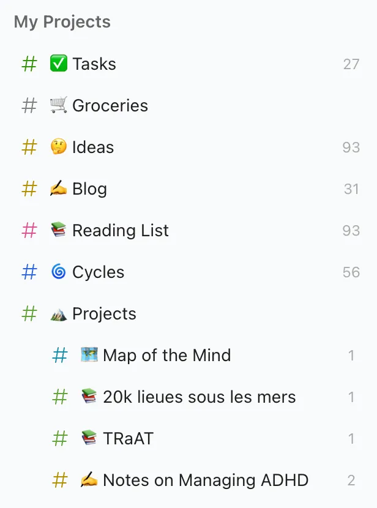
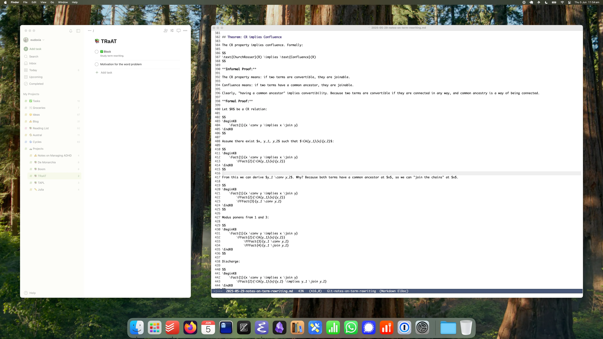
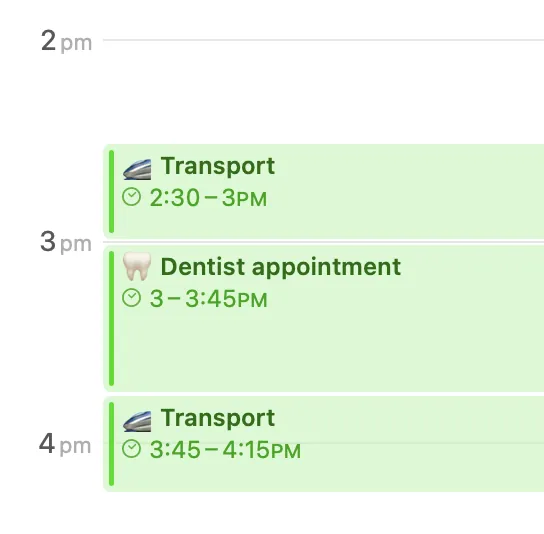

> The pleasure is in foreseeing it, not in bringing it to term.
> 
> — Jorge Luis Borges, [_Selected Non-Fictions_](https://www.goodreads.com/book/show/864175.Selected_Non_fictions)

This post is about managing ADHD. It is divided into two sections: “Strategies” describes the high-level control system, “Tactics” is a list of micro-level improvements (really it should be called “stratagems”, since most are essentially about tricking yourself).

## Contents

1.  [Strategies](https://borretti.me/article/notes-on-managing-adhd#strategies)
    1.  [Chemistry First](https://borretti.me/article/notes-on-managing-adhd#chemistry-first)
    2.  [Memory](https://borretti.me/article/notes-on-managing-adhd#memory)
    3.  [Energy](https://borretti.me/article/notes-on-managing-adhd#energy)
    4.  [Procrastination](https://borretti.me/article/notes-on-managing-adhd#procrastination)
    5.  [Introspection](https://borretti.me/article/notes-on-managing-adhd#introspection)
    6.  [Time](https://borretti.me/article/notes-on-managing-adhd#time)
2.  [Tactics](https://borretti.me/article/notes-on-managing-adhd#tactics)
    1.  [Task Selection](https://borretti.me/article/notes-on-managing-adhd#task-selection)
    2.  [Visual Field Management](https://borretti.me/article/notes-on-managing-adhd#visual-field-management)
    3.  [Project Check-Ins](https://borretti.me/article/notes-on-managing-adhd#project-check-ins)
    4.  [Centralize Your Inboxes](https://borretti.me/article/notes-on-managing-adhd#centralize-your-inboxes)
    5.  [Inbox Zero](https://borretti.me/article/notes-on-managing-adhd#inbox-zero)
    6.  [Inbox Bankruptcy](https://borretti.me/article/notes-on-managing-adhd#inbox-bankruptcy)
    7.  [Do It On Your Own Terms](https://borretti.me/article/notes-on-managing-adhd#do-it-on-your-own-terms)
    8.  [Replace Interrupts with Polling](https://borretti.me/article/notes-on-managing-adhd#replace-interrupts-with-polling)
    9.  [Accountability Buddy](https://borretti.me/article/notes-on-managing-adhd#accountability-buddy)
    10.  [Plan First, Do Later](https://borretti.me/article/notes-on-managing-adhd#plan-first-do-later)
    11.  [Derailment](https://borretti.me/article/notes-on-managing-adhd#derailment)
    12.  [Using OCD to Defeat ADHD](https://borretti.me/article/notes-on-managing-adhd#using-ocd-to-defeat-adhd)
    13.  [The Master of Drudgery](https://borretti.me/article/notes-on-managing-adhd#the-master-of-drudgery)
    14.  [Thrashing](https://borretti.me/article/notes-on-managing-adhd#thrashing)
    15.  [Put Travel in the Calendar](https://borretti.me/article/notes-on-managing-adhd#put-travel-in-the-calendar)
    16.  [Choice of Tools](https://borretti.me/article/notes-on-managing-adhd#choice-of-tools)
3.  [Resources](https://borretti.me/article/notes-on-managing-adhd#resources)
4.  [Acknowledgements](https://borretti.me/article/notes-on-managing-adhd#acknowledgements)

## Strategies

High-level advice, control systems.

## Chemistry First

_ADHD has a biological cause and drugs are the first-line treatment for good reasons. There is no virtue in trying to beat it through willpower alone._

The first-line treatment for ADHD is stimulants. Everything else in this post works best as a complement to, rather than as an alternative to, stimulant medication. In fact most of the strategies described here, I was only able to execute _after_ starting stimulants. For me, chemistry is the critical node in the tech tree: the todo list, the pomodoro timers, etc., all of that was unlocked by the medication.

Some people can’t tolerate a specific stimulant. But there are many stimulant and non-stimulant drugs for ADHD. I would prefer to exhaust all the psychiatric options before white-knuckling it.

A lot of people don’t want to take medication for shame-based reasons. There is a lot of pill-shaming in the culture. You must learn to ignore it: we are automata, our minds are molecules in salt water.

### Example: Melatonin

As a motivating example for the “salt water automaton” view: I struggled with sleep hygiene for a long time. It felt like WW1: throwing wave after wave of discipline at it and always failing. I would set an alarm, for, say, 10pm, that said: it is time to go to bed. How many times did I obey it? Never. I was always doing something more important.

What fixed it? Melatonin. I have an alarm that goes off at 8pm to remind me to take melatonin. The point of the alarm is not, “now you must log off”, which is a very discipline-demanding task. The point of the alarm is simply: take this pill. It takes but a moment. Importantly, I’m not committing to anything other than taking a pill. Thirty, forty minutes later, I _want_ to sleep. That is the key thing: the melatonin has changed my preferences. And then I don’t need willpower to close the sixteen Wikipedia tabs or whatever, because I _want_ to sleep more than I want to scroll, or watch YouTube.

### Internal and External Change

The broader perspective here is that personal growth is a dialogue between internal changes and external changes.

Internal changes might come from medication, meditation, therapy, coaching, or practicing habits for a long enough time. External changes are the scaffolding around the brain: using a todo list, and using it effectively. Using a calendar. Clearing your desk so you don’t get distracted by things. Journaling, so that you can introspect and notice patterns: which behaviours leads to a good workday, and which behaviours lead to a day being wasted.

Are internal changes more important? Kind of. It’s more a back and forth, where internal changes unlock external changes which unlock further internal changes.

Here’s an example: you (having undiagnosed ADHD) try to set a schedule, or use a todo list, or clean your bed every day, but it doesn’t stick. So you get on medication, and the medication lets you form your first habit: which is using a todo list app consistently, checking it every morning. Then, with the todo list as a core part of your exocortex, you start adding recurring tasks, and forming other simple habits: you have a daily recurring task to make your bed, and so every morning when you check the todo list, you see the task, and make your bed, and in time, with your now-functioning dopamine system, you make a habit to make your bed every day, such that you no longer need to have that in the todo list.

So the timeline is:

1.  Internal change: starting medication unlocks…
2.  External change: using a todo list, which provides scaffolding (e.g. daily recurring tasks) for forming new habits, which unlocks
3.  Internal change: new habits formed (make bed, brush teeth in the morning)

Taking Ritalin with no plan for what you will do today/tomorrow/this week doesn’t work. Dually, an ambitious todo list will sit idle if your brain won’t let you execute it. So personal growth comes from using _both_ internal and external changes, like a ladder with alternating left-right steps.

## Memory

_A todo list is a neuroprosthesis that augments long-term memory for tasks._

I use [Todoist](https://www.todoist.com/) on my desktop and my phone. The pro plan is worth it. I don’t really think of it as an app, rather, it’s a cognitive prosthesis.

The todo list provides three things:

-   **Memory:** the list remembers things for me. I’m not at the mercy of my brain randomly pinging me that I forgot to do X or I want to someday do Y. The todo list remembers.
-   **Order:** the todo list lets you drag and drop tasks around, so you can figure out the ordering in which you’re going to do them.
-   **Hierarchy:** the todo list lets you break tasks down hierarchically and without limit.

Of these, the most important is memory. The todolist is an action-oriented long term memory prosthesis.

This is especially useful for habit formation: my biggest blocker with forming habits was just remembered that I’d committed to doing something. If you think, i will make the bed every day, you might do it today, tomorrow, and by the third day you forget. You’re failing by simply forgetting to show up, which is a sad way to fail. By making something a recurring task on the todo list, it ensures I will see it. In a sense, the todo list turns many habits into one. You don’t need to remember “I will make my bed every day”, “I will floss my teeth every night”, etc., because the todolist remembers all those things for you. You only need to form a _single_ habit: checking the todo list.

Analogously, I often fail to finish projects simply because I forget about them. I start reading a book, but I don’t write it down anywhere (say, in Goodreads) that “I’m reading this book” is something I have committed to. I leave the book on a table where it’s out of sight (and therefore out of mind) for all of my waking hours. I glance at it occasionally and think, oh, yeah, I was reading that book, and then I’m distracted by something else. And weeks later, when I’ve already started another book, I notice the first book, with the bookmark on page 20, abandoned.

The todolist prevents this failure mode: you create a project to represent reading the book, and that project is now tracked, and when you open the todo list, you can see it in the list of active projects.

### How I Use Todoist

In Todoist, every task is part of a [project](https://www.todoist.com/help/articles/introduction-to-projects-TLTjNftLM) (which really should just be called a list). My sidebar looks like this:



**Tasks** is the list for ad-hoc tasks. Mostly chores and things that don’t fit in elsewhere. Unload the dishwasher, reply to this email, etc. The only rule for this list is that everything in it must be scheduled.

**Groceries** is self-explanatory.

**Ideas** is the where every half-formed goal, intention, project idea etc. goes. “Go deeper into metta” and “learn how to use the slide rule” and “go penguin watching in Manly” and “write a journalling app” and “learn [PLT Redex](https://redex.racket-lang.org/)”. I put these things here so that they don’t live in my brain. And occasionally I go through the list and promote something into an actual, active project.

**Blog** is like the ideas list specifically ideas for blog posts.

**Reading List** is for media I want to consume. This is divided into: fiction books, non-fiction books, technical books, blog posts, papers, games, films.

**Cycles** is for recurring tasks. This one is divided into sections by period: daily, weekly, and above. The daily recurring tasks are things like “take vitamin D”, “meditate”, and the inbox-clearing task.

**Projects** is a container for actual projects: an objective which takes multiple tasks to accomplish. Why lift projects into lists? Why not just use a top-level task to represent the project’s objective, and nested subtasks to represent the execution steps of the project? Because having the project in the sidebar is one mechanism I use to ensure I don’t forget about it. Every time I glance at the todo list, I can see the list of active projects. I can notice if something has not been worked on for a while, and act on it. Otherwise: out of sight, out of mind.

## Energy

_The difficulty class of the tasks you can perform declines throughout the day._

There are many metaphors for the concept of mental energy. [Spoon theory](https://en.wikipedia.org/wiki/Spoon_theory), for example. The usual metaphor is that “mental energy” is like a battery that is drained through the day, in greater and lesser quantities, and is replenished by sleep.

To me, energy is less like a battery and more like voltage. Some machines require a threshold voltage to operate. Below that voltage they don’t just operate slower, they don’t operate at all. Analogously, different categories of activity have different threshold voltages. For me, it’s like this:

1.  Things I am averse to, the things I intuitively want to put off because they bring up painful emotions, are high-voltage.
2.  Creative, open-ended work is high-voltage to start, but once you get started, keeping it going is medium-voltage.
3.  Simple chores like cleaning, throwing clothes in the washing machine, etc. are low-voltage.

And when I wake up I have the highest possible voltage, and throughout the course of the day the voltage declines. And that’s the key difference from spoon theory: spoons are fungible across time, voltage is not. For each category of activity, there is a span of the day when I can action it.

When I wake up, I do my morning routine, get some quick wins, and then I try to tackle the thing I dread the most, as early in the morning as possible, because that’s the time of day when I have the most energy and self-control. I get that done and I move on.

(Another reason to do the dreaded tasks first: if you put it off to, say, late morning, well, why not put it off again? And again and again. And then it’s 7pm and you can’t even think about the task, and it’s late, and I don’t have energy, so I couldn’t even do it if I wanted to, so let’s do it tomorrow.)

And then, when I have removed that burden, I work on projects. The creative, generative, intellectual things. The things that move some kind of needle, and aren’t just pointless chores.

And when I run out of energy to create, I read.

And when I run out of energy to read, I clean and go to the gym and do the other things.

And when the sun goes down everything starts to unravel: I have zero energy and the lazy dopamine-seeking behaviour comes out. So I take melatonin, and try to be in bed before the instant gratification monkey seizes power.

## Procrastination

_Typology of procrastination, approaches._

In my ontology there are three types of procrastination:

-   **ADHD Procrastination:** you want to do the task, but can’t because of distraction/hyperactivity.
-   **Anxious Procrastination:** you know you have to do the task, but you don’t want to, because it triggers difficult emotions.
-   **Decision Paralysis Procrastination:** you _don’t know_ how to execute the task, because it involves a decision and you have difficulty making the decision.

### ADHD Procrastination

This is the easiest kind to address. The solution is pharmacological treatment for ADHD + having a productivity system and some tricks.

### Anxious Procrastination

This one is harder. The good thing is you know, cognitively, what you have to do. The hard part is getting over the aversion.

In the short term, the way to fix this is to do it scared. Accept the anxiety. Asking for help also works, sometimes you just need someone in the room with you when you hit send on the email. You can also use techniques like CBT to rationally challenge the source of the anxiety and maybe overcome it.

In the long term: write down the things you procrastinate one due to anxiety, and find the common through-line, or the common ancestor. By identifying the emotional root cause, you can work on fixing it.

### Decision Paralysis Procrastination

And this is the hardest, because you don’t know, cognitively, what the right choice is, and also you probably have a lot of anxiety/aversion around it. Many things in life are susceptible to this: you have set of choices, there’s good arguments for/against each one, and you have a lot of uncertainty as to the outcomes. And so you ruminate on it endlessly.

I don’t have a good general solution for this.

Talking to people helps: friends, therapists, Claude. This works because thinking by yourself has diminishing returns: you will quickly exhaust all the thoughts you will have about the problem, and start going in circles. Often people will bring up options/considerations I would never have thought of. Sometimes, if you’re lucky, that’s all it takes: someone mentions an option you had not considered and you realize, oh, it was all so simple.

One thing to consider is that _thinking in your head_ is inherently circular, because you have a limited working memory, and you will inevitably start going in circles. Writing things down helps here. Treat the decision, or the emotions behind it, like an object of study, or an engineering problem. Sit down and write an essay about it. Name the arguments, number the bullet points, refer back to things. Make the thoughts into real, physical, manipulable entities.

## Introspection

_Journaling is good for detecting maladaptive patterns and tracking your progress._

I keep a hierarchical journal in [Obsidian](https://obsidian.md/). Hierarchical because I have entries for the days, weeks, months, and years. The directory tree looks like this:

```
Journal/
  Daily/
    YYYY/
      MM/
        YYYY-MM-DD.md
  Weekly/
    YYYY/
      YYYY-WW.md
  Monthly/
    YYYY/
      YYYY-MM.md
  Yearly/
    YYYY.md
```

In the morning I finish yesterday’s journal entry, and begin today’s. Every Sunday I write the review of the week, the first of each month I write the review of the previous month, the first of each year I review the past year. The time allotted to each review is in inverse proportion to its frequency: so a monthly review might take an hour while a yearly review might take up a whole morning.

The daily reviews are pretty freeform. Weekly and above there’s more structure. For example, for the weekly reviews I will write a list of the salient things that happened in the week. Then I list on what went well and what went poorly. And then I reflect on how I will change my behaviour to make the next week go better.

Journaling is a valuable habit. I started doing it for vague reasons: I wasn’t sure what I wanted to get out of it, and it took a long time (and long stretches of not doing it) until it became a regular, daily habit. I’ve been doing it consistently now for three years, and I can identify the benefits.

-   The main benefit is that to change bad patterns, you have to notice them. And it is very easy to travel in a fix orbit, day in, day out, and not notice it. Laying it out in writing helps to notice the maladaptive coping mechanisms. Reading back over the journal entries helps you notice: when an event of type X happens, I react with Y.
    
-   Today’s journal entry is a good default place for writing ad-hoc notes or thoughts. Often I wanted to write something, but didn’t know where I would file it (how do you even file these little scraps of thought?) and from not knowing where to put it, I would not do it. Nowadays I just begin writing in the journal. Later, if it is valuable to file it away, I do so.
    
-   Creating a journal entry in the morning is a good opportunity to go over the goals and priorities for the day and explicitly restate them to myself.
    
-   The final benefit is retrospection: I can look at the past and see how my life has changed. And this is often a positive experience, because the things that worried me didn’t come to pass, the things I used to struggle with are now easy, or at least easier.
    
    There’s a paradox with productivity: when you grind executive function enough, things that you used to struggle with become quotidian. And so what was once the ceiling becomes the new floor. You no longer feel proud that you did X, Y, Z because that’s just the new normal. It’s like the hedonic treadmill. You might feel that you never get to “productive”. Journaling helps to combat this because you can see how far you’ve come.
    

## Time

_Manage time at the macro level with calendars, at the micro level with timers._

To manage time, you need a calendar (macro) and a timer (micro).

### Macro

At the macro level, I use the calendar very lightly. Mostly for social things (to ensure I don’t forget an event, and that I don’t double-book things). I also use it to schedule the gym: if the goal is to lift, say, five times a week, I schedule five time blocks to lift. Lifting is special because it has a lot of temporal constraints:

1.  I lift exactly _n_ times per week.
2.  I lift at most once a day.
3.  I lift in the evening, which potentially clashes with social things.
4.  There are adjacency constraints, e.g. doing shoulders the day before chest is bad.
5.  There is at least one rest day which has to be scheduled strategically (e.g. to have maximal distance between successive deadlift sessions).

But outside these two categories, my calendar is empty.

The calendar might be useful to you as a self-binding device. If you keep dragging some project along because you “haven’t made time” for it: consider making a time block in the calendar, and sticking to it. Creating a calendar event is, literally, making time: it’s like calling `malloc_time()`.

Some people use the calendar as their entire todo list. I think this kind of works if your todo list is very coarse grained: “buy groceries” and “go to the dentist”. But I have a very fine-grained todo list, and putting my tasks in the calendar would make it overwhelming.

Another problem with calendars is they are too time-bound: if I make a calendar block to do something, and I don’t do it, the calendar doesn’t know it. It just sits there, forgotten, in the past. In a todo list, everything gets dragged along until I explicitly complete it. Along the same lines, the calendar is not good for collecting vague ideas and plans for things you want to do in the future, while todo lists are ideal for this.

### Micro

The problem with todo lists is that they’re timeless: there is no sense of urgency. You look at the list and think, I could do the next task now, or in five minutes, or in an hour. There’s always _some_ time left in the day. Or tomorrow. You need a way to manufacture urgency.

If you have ADHD you’ve probably heard of the Pomodoro method, tried it, and bounced off it. The way it’s framed is very neurotypical: it’s scaffolding around _doing_, but ADHD people often have problems with the doing itself. And so the scaffolding is kind of pointless.

The method works well in three kinds of contexts:

-   **Overcoming Aversion:** when you have a large number of microtasks, each of which takes a few seconds to a few minutes, but the number of them, and the uncertainty factor, makes the sum seem a lot larger. A classic example for me is having to reply to like ten different people. Realistically, each person can be handled in 15s. One or two might require a couple of minutes to compose a longer reply. But often I will avoid those tasks like the plague and drag them across the entire day.
    
    The pomodoro method works here because you’re basically trading (up to) 25m of pain for an entire day’s peace and quiet. So you get all the annoying little tasks together, start a timer, and go through them. And usually you’re done in maybe ten minutes. And you feel _really_ good after, because all those annoying little tasks are done.
    
    It really is amazing what a little bit of fake urgency can do.
    
-   **Starting:** sometimes the problem is just starting. It is very trite, but it’s true. You have something you _want to want_ to do, but don’t _want_ to do. I want to want to read this book, to learn this topic, to write this blog post, to work on this software project. But I don’t _want_ to do it. The pomodoro method helps you start.
    
    You’re not committing to finishing the project. You’re not committing to months or weeks or days or even hours of work. You’re committing to a half hour. And if you work just that half hour: great, promise kept. 30m a day, over the course of a single month, is 15h of work. And often I start a 30m timer and end up working four hours, and maybe that’s a good outcome.  
    
    你并没有承诺要完成这个项目。你并没有承诺要工作几个月、几个星期、几天甚至几个小时。你承诺的是半个小时。如果你只工作了半个小时：很好，承诺兑现了。每天 30 分钟，一个月下来就是 15 个小时。我经常从 30m 开始计时，最后工作 4 个小时，也许这是个好结果。
    
-   **Stopping:** dually, sometimes the problem is stopping. If you’re trying to advance multiple projects at the same time, if you hyperfocus on one, it eats into the time you allocated for the others. And more broadly, spending too much time on one project can derail all your plans for the day. Maybe you meant to go to the gym at 6pm but you got so stuck in with this project that it’s 8:30pm and you’re still glued to the screen. So the gym suffers, your sleep schedule suffers, etc.  
    
    **停止：** 同样，有时问题在于停止。如果你想同时推进多个项目，如果你过度专注于一个项目，就会占用你分配给其他项目的时间。更广义地说，在一个项目上花费太多时间会破坏你当天的所有计划。也许你本打算下午 6 点去健身房，但你太专注于这个项目了，以至于到了晚上 8 点半，你还目不转睛地盯着屏幕。于是，健身房受影响，睡眠时间受影响，等等。
    
    Actually stopping when the pomodoro timer goes off can prevent excessive single-mindedness.  
    
    当 Pomodoro 计时器熄灭时停下来，可以防止过度专注。
    
    Additionally, the five-minute break at the end of the pomodoro block is useful. It’s a time to get up from the computer, unround your shoulders, practice mindfulness, essentially, all those little things that you want to do a few times throughout the day.  
    
    此外，番茄时间结束时的五分钟休息时间也很有用。这时候，你可以从电脑前站起来，松开肩膀，练习正念，基本上，所有这些小事你都可以在一天中做上几次。
    

## Tactics  战术

Stratagems, tricks.  策略、窍门

## Task Selection  任务选择

_To select the next task, pick either the shortest or the most-procrastinated task.  

选择下一项任务时，可以选择时间最短或最拖沓的任务。_

I don’t like the word “prioritize”, because it has two subtly different meanings:  

我不喜欢 "分清主次 "这个词，因为它有两种微妙不同的含义：

-   “Weak prioritization” means to sort a list of tasks by some unspecified criterion, that is, to establish an order where some things are prior to another.  
    
    "弱优先级排序 "是指按照某些未指定的标准对任务列表进行排序，也就是确定一个顺序，让某些事情先于另一些事情。
-   “Strong prioritization” is to sort a list _specifically_ by importance.  
    
    而 "强优先级排序 "是指按照重要性对列表进行排序 _。_

“Weak prioritization” is something everyone should do: it takes a moment to go over the todo list and drag the tasks into more or less the order in which you will do them. This keeps the most relevant tasks near the top, which is where your eyes naturally go to.  

"弱优先级排序 "是每个人都应该做的事：花一点时间查看待办事项列表，然后将任务拖入与你要做的任务差不多的顺序。这样可以把最相关的任务放在最上面，你的视线自然就会停留在那里。

“Strong prioritization” is a terrible job scheduling algorithm. Importance alone is not good enough.  

"强优先级 "是一种糟糕的工作安排算法。仅仅考虑重要性是不够的。

Consider the case where you have a very important task A which takes a long time to finish, and a less important task B which takes 5m to finish. For example, writing an essay versus replying to an email. Which should you do first? I would execute B first, because doing so in turn unblocks B’s successor tasks. If you reply to the email and then get to work on task A, the other person has time to read your email and reply to you. And the conversation moves forward while you are otherwise engaged.  

假设您有一项非常重要的任务 A，需要很长时间才能完成，而另一项不太重要的任务 B 则需要 5 分钟才能完成。例如，写一篇文章和回复一封电子邮件。你应该先做哪个？我会先执行 B，因为这样做反过来会解除 B 的后续任务的阻塞。如果你先回复邮件，然后开始处理任务 A，那么对方就有时间阅读你的邮件并回复你。在你忙于其他事情的时候，对话会继续进行。

Of course, the pathological version of this is where you only action the quick wins: all the minute little chores get done instantly, but the big tasks, requiring long periods of concentration, get postponed perpetually.  

当然，这种情况的病态版本就是你只做速赢的事情：所有细碎的小杂事都能立即完成，但需要长时间集中精力的大任务却被永远推迟了。

My task-selection algorithm is basically: do the shortest task first, with two exceptions:  

我的任务选择算法基本上是：先做最短的任务，但有两个例外：

1.  Stalled tasks get a priority bump. If I created a task weeks ago, or if I’ve been postponing in for many days in a row, it has to be done now.  
    
    停滞不前的任务优先级会提高。如果我在几周前创建了一项任务，或者我已经连续推迟了很多天，那么现在就必须完成它。
2.  Content-dependence: if I’m working on a particular project, I’d rather focus on tasks from that project, rather than from the global todo list.  
    
    内容依赖性：如果我正在处理一个特定的项目，我宁愿专注于该项目中的任务，而不是全局待办事项列表中的任务。

## Visual Field Management  视野管理

_To remember something, put it in your visual field. Dually: to forget, get it out of sight.  

要记住一件事，就把它放在你的视野里。双管齐下：要忘记，就让它离开视线。_

Out of sight, out of mind. The corollary: to keep something in mind, put it in your visual field; to keep it out, leave it out.  

眼不见，心不烦。推论：要记住某样东西，就把它放在视野里；要忘掉某样东西，就把它丢在视野外。

My desk is very spartan: there’s a monitor, a mouse, and a keyboard, and a few trinkets. My desktop is empty. There are no files in it. The dock has only the apps I use frequently. And at a higher level, I try to keep the apartment very clean and orderly. Because everything that’s out of place is a distraction, visual noise. That’s the negative aspect: the things I remove.  

我的办公桌很简陋：一个显示器、一个鼠标、一个键盘和一些小饰品。我的桌面是空的。里面没有文件。底座上只有我常用的应用程序。从更高层次来说，我尽量让公寓保持整洁有序。因为所有不合适的东西都会分散注意力，造成视觉噪音。这是消极方面：我移除的东西。

The positive aspect, the things I keep in my visual field: most of the time, I have two windows open on my computer the todo list occupies the left third of the screen, the right two-thirds are occupied by whatever window I have open at the time, e.g.:  

积极的方面是，我在视野中保留的东西：大多数时候，我都会在电脑上打开两个窗口，待办事项列表占据了屏幕左侧三分之一的位置，右侧三分之二的位置则被我当时打开的任何窗口占据，例如：...............：



And so at a glance, I can see:  

因此，我一眼就能看到

1.  What I’m currently working on.  
    
    我目前在做什么
2.  What I will work on next.  
    
    我下一步要做什么。
3.  The list of active projects, so that I don’t forget they exist.  
    
    活动项目列表，这样我就不会忘记它们的存在。

## Project Check-Ins  项目检查

_Keep in regular contact with long-running projects.  

与长期项目保持定期联系。_

A common failure mode I have is, I will fail to finish a project because I forget I even started it. Or, relatedly: I will let a project drag on and on until enough time has passed that my interests have shifted, the sun has set on it, and it is now a slog to finish.  

我常见的一种失败模式是，我无法完成一个项目，因为我忘记了我甚至已经开始了这个项目。或者，与此相关的是：我会让一个项目一拖再拖，直到足够长的时间过去，我的兴趣已经转移，太阳已经落山，现在要完成它已是一件难事。

One reason I do this is that creative/intellectual work often requires (or feels like it requires) long stretches of uninterrupted time. So I procrastinate working on something until I can find such a chunk of time. Which never comes. Time passes and the project begins to slip the moorings of my attention, as other new and shiny things arrive.  

我这样做的一个原因是，创意/智力工作往往需要（或感觉需要）长时间的不间断时间。因此，我会拖延工作，直到找到这样的大块时间。但时间总是不等人。随着时间的流逝，随着其他新的闪亮事物的到来，这个项目开始失去我的关注。

And sometimes I will pick the project back up after months or years, and I have lost so much context, it’s impossible to know what I even intended. And then you procrastinate even more, because you don’t want to feel the guilty of picking up a project and realizing it has become strange and unfamiliar to you.  

有时我在数月或数年后重新拾起这个项目，却发现它已经失去了太多的背景，我甚至无法知道自己的初衷是什么。然后你就会更加拖延，因为你不想在拿起一个项目时发现它对你来说已经变得陌生而有负罪感。

One way to combat this is to make regular project checkins. This could be a daily or few-times-a-week recurring task on Todoist that just says “spend 30m on this project”.  

解决这个问题的方法之一就是定期检查项目。这可以是 Todoist 上的一个每日或每周几次的循环任务，上面只写 "在这个项目上花 30 分钟"。

You don’t even have to work on the thing: just allocate fifteen minutes to hold the project in your mind and nothing else. If it’s creative writing, you might open the Word document and just look at it. If it’s a programming project: read the Jira board and look at the code again. Don’t write anything. Just read the code. You will likely come up with a few tasks to do, so write those down. Think. Plan. Build up the structures in your mind, refresh the caches. If you can do, do, otherwise, plan, and if you can’t even do that, read.  

你甚至不需要去做这件事：只需分配十五分钟的时间在脑海中记住这个项目，其他什么都不用做。如果是创意写作，你可以打开 Word 文档看看。如果是编程项目：阅读 Jira 公告板，再看看代码。不要写任何东西。只看代码。你很可能会想到一些要做的任务，把它们写下来。思考。计划。在脑海中建立结构，刷新缓存。如果你能做到，就去做，否则就去计划，如果你连计划都做不到，那就去阅读。

When you’re doing this regularly, when you’re in regular contact with the project, when the shape of it is clear in your mind, you will have the tasks on the top of your mind, you will no longer feel that you need a giant empty runway of time to work on it, you will be able to work on it in shorter chunks.  

当你经常这样做的时候，当你经常接触这个项目的时候，当你的脑海中清晰地浮现出这个项目的雏形的时候，你就会把这些任务放在脑海中的首位，你就不会再觉得你需要大量的空闲时间来完成这个项目，你就能够在较短的时间内完成它。

To manage long-term creative work, keep in regular contact. That doesn’t mean work on them every day, but maybe _look_ at them every day.  

要管理长期的创作工作，就要保持经常联系。这并不意味着每天都要工作，但也许_每天都要看看_它们。

The [pomodoro method](https://borretti.me/article/notes-on-managing-adhd#timers) works here. Set a timer for just 25m to keep in touch with the project.  

[pomodoro 方法](https://borretti.me/article/notes-on-managing-adhd#timers)在这里很有效。设置一个 25m 的计时器，与项目保持联系。

## Centralize Your Inboxes  集中管理收件箱

_Bring all tasks, broadly defined, into one todo list.  

将广义上的所有任务集中到一个待办事项列表中。_

Life is full of inboxes:  

生活中充满了收件箱：

1.  Email  电子邮件
2.  DMs on Twitter, iMessage, WhatsApp, Signal, Discord, etc.  
    
    Twitter、iMessage、WhatsApp、Signal、Discord 等软件上的 DM。
3.  Twitter bookmarks  Twitter 书签
4.  Browser bookmarks  浏览器书签
5.  Your Downloads folder.  您的下载文件夹。
6.  Messages in my myGov inbox.  
    
    我的政府收件箱中的信息。
7.  The physical mailbox in my apartment.  
    
    我公寓里的实体邮箱

These are inboxes because they fill up over time and need action to empty. You can also think of them as little domain-specific task lists. “Centralizing your inboxes” means moving all these tasks from their silos into the one, central todo list.  

这些都是收件箱，因为它们会随着时间的推移而填满，需要采取行动才能清空。你也可以把它们看作是特定领域的小任务列表。"集中收件箱 "意味着将所有这些任务从各自的 "孤岛 "转移到一个中央待办事项列表中。

For example, I have a daily task called “catch up” to clear the digital inboxes:  

例如，我每天都有一项名为 "追赶 "的任务来清理数字收件箱：

1.  Go through all my communication apps (email, Discord, Twitter DMs etc) and triage the unread conversations: if something needs replying to, I either reply immediately or make a task to reply later so I don’t forget.  
    
    查看我所有的通讯应用程序（电子邮件、Discord、Twitter DMs 等），分流未读对话：如果有需要回复的内容，我要么立即回复，要么制定任务稍后回复，以免忘记。
2.  File the contents of my Downloads folder.  
    
    将我的下载文件夹内容存档。
3.  Go through Twitter/browser bookmarks and turn them into tasks (e.g., if I bookmark an article, the task is to read the article).  
    
    浏览 Twitter/浏览器书签，将其转化为任务（例如，如果我收藏了一篇文章，任务就是阅读这篇文章）。

In this way I mostly manage to stay on top of comms.  

通过这种方式，我基本上能保持通讯畅通。

## Inbox Zero  零收件箱

_All inboxes should be at zero.  

所有收件箱都应为零。_

You have probably heard of inbox zero. It sounds like LinkedIn-tier advice. But if you struggle with comms, with replying to people in a timely manner (or at all), inbox zero is a good strategy. There are two reasons, briefly:  

您可能听说过 "收件箱零"。这听起来像是 LinkedIn 级别的建议。但是，如果你在通信、及时（或根本不及时）回复他人方面有困难，那么收件箱归零就是一个很好的策略。简而言之，有两个原因：

-   Inbox zero has no false negatives: if an inbox is empty, you know you’ve handled everything.  
    
    收件箱清零不会产生错误的负面影响：如果收件箱是空的，你就知道你已经处理好了一切。
-   Important communications have a way of “camouflaging” themselves among irrelevance.  
    
    重要的通信有一种在无关紧要中 "伪装 "自己的方式。

And, like everything: before you make it into a habit, it feels incredibly time-consuming and labour-intensive. But once you make it into a habit, it’s almost effortless.  

而且，就像所有事情一样：在你把它变成习惯之前，会感觉非常耗时耗力。但一旦养成习惯，几乎不费吹灰之力。

So, I will give you an example. I come in to work, and read four emails. Three could’ve been archived outright, one needed a reply from me. And I said, oh, I’ll get to it in a second. And then I got distracted with other tasks. And throughout the day I kept glancing at the email client, and thinking, yeah, I will get to it. Eventually I got used to those four emails: they are the “new normal”, and what’s normal doesn’t require action. I would think: if those emails are there, and I already looked at them, then it’s probably fine. At the end of the day I looked at the inbox again and saw, wait, no, one of those emails was actually important. That’s the failure mode of inbox greater-than-zero: the important stuff hides among the irrelevant stuff, such that a quick glance at the todo list doesn’t show anything obviously wrong. Dually, with inbox zero, if you see a single email in the inbox, you know there’s work to do.  

我给你举个例子。我上班时读了四封邮件。三封可以直接存档，一封需要我回复。我说，哦，我马上就回。然后我就分心去做其他事情了。整整一天，我都在瞥一眼电子邮件客户端，心想，好的，我会处理的。最终，我习惯了这四封邮件：它们是 "新常态"，而常态并不需要采取行动。我会想：如果这些邮件就在那里，而且我已经看过了，那就应该没问题。一天结束后，我再看收件箱，发现等等，不对，其中有一封邮件其实很重要。这就是收件箱大于零的失败模式：重要的东西藏在无关紧要的东西中，因此快速浏览待办事项列表并不会发现任何明显的问题。相反，如果收件箱为零，只要看到收件箱里有一封邮件，就知道有工作要做。

Inbox zero removes ambiguity. If there’s _anything_ in the inbox, you know, unambiguously, you have a task to complete. If there is nothing in the inbox, you know, unambiguously, there is nothing to do. Inbox zero frees you from false negatives, where you think you’ve handled your correspondence but there’s some important email, camouflaged among the trivial ones, that has not been replied to.  

收件箱归零消除了模糊性。如果收件箱中有_任何东西_ ，你就会清楚地知道，你有任务要完成。如果收件箱里什么都没有，你就会清楚地知道，没有什么事情要做。收件箱为零可以让你避免错误的否定，即你认为你已经处理好了你的信件，但有一些重要的邮件被掩盖在琐碎的邮件中，没有得到回复。

A problem with doing inbox zero is most communication apps (like Discord, Slack, iMessage etc.) don’t have a concept of an inbox, just the read/unread flag on conversations. Since there’s no separation between the inbox and the archive, it takes more discipline to ensure every conversation is replied to.  

收件箱为零的一个问题是，大多数通讯应用程序（如 Discord、Slack、iMessage 等）都没有收件箱的概念，只有对话上的已读/未读标记。由于收件箱和存档之间没有区分，要确保每条对话都得到回复需要更多的纪律。

## Inbox Bankruptcy  收件箱破产

_If an inbox is overwhelmed, archive it in a recoverable way.  

如果收件箱不堪重负，应以可恢复的方式将其归档。_

By the time I started to become organized I’d already accumulated thousands of bookmarks, unread emails, files in my downloads folder, papers in my physical inbox, etc. It would have been a Herculean effort to file these things away. So I didn’t. All the disorganized files, I wrapped them up in a folder and threw them in my `Attic` folder. Emails? Archived. Bookmarks? Exported to HTML, archived the export, and deleted them from the browser.  

当我开始整理的时候，我已经积累了成千上万的书签、未读邮件、下载文件夹中的文件、实际收件箱中的文件等。如果要把这些东西归档，将是一项艰巨的任务。所以我没有这么做。所有杂乱无章的文件，我都用文件夹包好，扔进了我的 `Attic` 文件夹。电子邮件？归档。书签？导出为 HTML，将导出存档，然后从浏览器中删除。

Ideally you should do this once, at the start.  

理想情况下，你应该在一开始就做一次这样的工作。

And by archiving things rather than deleting them, you leave open the possibility that as some point in the future, you might be able to action some of those things. Triage the old bookmarks, sort your filesystem, etc.  

通过存档而不是删除，你就有可能在未来的某个时间点对其中的某些内容采取行动。分拣旧书签、整理文件系统等。

## Do It On Your Own Terms  

按自己的意愿行事

_Bring aversion-causing tasks into an environment that you control.  

将导致厌恶的任务带入你能控制的环境中。_

If you’re averse to doing something, for emotional reasons, one way to overcome the aversion is to do it as much as possible on your own terms.  

如果你因为情感原因而厌恶做某件事情，克服厌恶感的方法之一就是尽可能按照自己的意愿去做。

An example: you have to fill out some government form. You’re averse to it because you worry about making a mistake. And just the thought of opening the form fills you with dread. So, take the boxes in the form, and make a spreadsheet for them. If fonts/colours/emojis/etc. if that makes it feel more personal, or like something you designed and created. Then fill out the form in the spreadsheet. And then copy the values to the form and submit.  

举个例子：你必须填写一些政府表格。你不喜欢填表，因为你担心会出错。只要一想到要打开表格，你就会感到恐惧。因此，把表格中的方框做成电子表格。如果字体/颜色/表情符号等能让人感觉更有个性，或者像你设计和创造的东西，那就更好了。然后在电子表格中填写表格。然后将数值复制到表格中并提交。

This helps because instead of performing the task in this external domain where you feel threatened, you’re performing the task in your own domain, in your own terms.  

这很有帮助，因为你不是在你感到威胁的外部领域执行任务，而是在你自己的领域、以你自己的方式执行任务。

Another example: you have an email you have to reply to, and you’re anxious about it. Just opening the email client gives you a bad feeling. Instead, try composing the email elsewhere, say, in a text editor. The change of environment changes the emotional connotation: you’re not replying to an email, you’re writing a text. You might even think of it as a work of fiction, a pseudoepigraphy.  

另一个例子：你有一封必须回复的电子邮件，你为此焦虑不安。只要打开电子邮件客户端，你就会有一种不祥的预感。相反，你可以尝试在其他地方撰写邮件，比如在文本编辑器中。环境的改变会改变情绪的内涵：你不是在回复邮件，而是在撰写文字。你甚至可以把它看作是一篇小说，一篇伪书法。

## Replace Interrupts with Polling  

用轮询取代中断

_Turn off notifications, check comms as an explicit task.  

关闭通知，将检查通信作为一项明确的任务。_

“Interrupts” means notifications, which arrive at unpredictable and often inconvenient times. “Polling” means manually checking the source of the notifications for things to action.  

"中断 "指的是通知，这些通知会在不可预知的、通常是不方便的时间到达。"轮询 "是指手动检查通知的来源，以便采取行动。

The obvious benefit of replacing interrupts with polling is you don’t get interrupted by a notification. The less obvious benefit is that when notifications are smeared throughout the day, it is easy for them to fall through the cracks. Something comes in when you’re busy, and you swipe it away, and forget about it, and realize days later you forgot to respond to an important message. Polling is focused: you’ve chosen a block of time, you’re committed to going through the notifications systematically. Instead of random islands of interruptions throughout the day, you have a few short, focused blocks of going through your notifications. Often I get an email while I’m on my phone and think, well, I can’t reply, typing on mobile is horrible, I’m on a train, etc. Polling usually happens at my desk so I have no excuses: I’m in the right environment and in the right mental state.  

用轮询代替中断的好处显而易见，那就是你不会被通知打断。另一个不那么明显的好处是，当通知遍布整个一天时，它们很容易被遗漏。当你很忙的时候，有东西进来了，你一扫而过就忘了，几天后才发现自己忘了回复一条重要信息。投票是有针对性的：你选择了一个时间段，致力于系统地查看通知。你不会在一天中被随意打断，而是在几个短时间内集中查看通知。我经常在用手机时收到一封邮件，然后想，我不能回复，在手机上打字太糟糕了，我还在火车上，等等。投票通常是在我的办公桌上进行的，所以我没有任何借口：我有合适的环境和精神状态。

This is so trite. “Put your phone on Do Not Disturb and silence notifications”. And yet it works. For a long time I resisted this because I aspire to be the kind of person who gets a message and replies within minutes. But I didn’t notice how much notifications were impairing my focus until one day I accidentally put the phone/desktop on DND and had a wonderfully productive, distraction-free day.  

这太老套了。把手机设置为 "请勿打扰 "并关闭通知。但它却很管用。很长时间以来，我一直拒绝这样做，因为我渴望成为那种收到信息后能在几分钟内回复的人。但我并没有注意到通知对我专注力的影响有多大，直到有一天，我不小心把手机/桌面调到了 "请勿打扰 "状态，这才让我度过了卓有成效、心无旁骛的一天。

## Accountability Buddy  问责伙伴

_Get someone to sit next to you while you work.  

工作时找个人坐在你旁边。_

If you’re struggling to work on something, work next to another person. Set a timer and tell them what you’re going to accomplish and when the timer ends tell them how you did. Just being around other people can make it easier to overcome aversion. This is why coworking spaces are useful.  

如果你在做某件事情时感到吃力，可以在其他人旁边工作。设置一个计时器，告诉他们你要完成什么，计时器结束后告诉他们你做得怎么样。只要和其他人在一起，就能更容易克服厌恶感。这就是为什么协同工作空间很有用。

If you don’t have a person around, you might try [Focusmate](https://www.focusmate.com/). It works for [some people](https://parconley.com/focusmate/).  

如果你身边没有人，你可以试试 [Focusmate](https://www.focusmate.com/)。它对[一些人](https://parconley.com/focusmate/)有效。

Sometimes I’ll start a conversation with Claude, lay out my plans for the day, and update Claude as I do things. If I’m stuck, or if I need help overcoming procrastination, I can ask Claude for help, and it’s easier to do that in an on-going thread because Claude already has the necessary context, so I don’t have to describe what I’m struggling with _ab initio_.  

有时我会和克劳德开始对话，列出我一天的计划，并在克劳德更新我的工作。如果我遇到困难，或者我需要帮助来克服拖延症，我可以向克劳德寻求帮助，在一个持续的主题中这样做更容易，因为克劳德已经掌握了必要的背景信息，所以我不必描述我在 _ab initio_ 挣扎的问题。

## Plan First, Do Later  

先计划，后行动

_Separate planning from action, so if you get distracted while acting, you can return to the plans.  

将计划与行动分开，这样如果你在行动时分心，就可以回到计划中来。_

Separating planning from doing can be useful. Firstly because planning/doing require different kinds of mental energy. When you’re too tired to do, you can often still plan. Secondly because by separating them you can look back and see how useful the plan was, how much you stuck to it, and then get better at planning.  

把计划和行动分开可能很有用。首先是因为计划和行动需要不同的精神力量。当你太累而无法行动时，往往还可以制定计划。其次，把计划和行动分开，你就可以回顾过去，看看计划有多有用，你对计划的坚持程度有多高，从而更好地制定计划。

Thirdly, and most importantly, because for ADHD people doing can be a source of distractions that impair other tasks. From [_Driven to Distraction_](https://www.goodreads.com/book/show/108593.Driven_to_Distraction):  

第三，也是最重要的一点，因为对于多动症患者来说，做事情可能会分散他们的注意力，从而影响其他任务的完成。摘自 [_《分心的驱动力》_](https://www.goodreads.com/book/show/108593.Driven_to_Distraction)：

> The first item on the list referred to a cough drop. As I read it, I asked her about it.  
> 
> 清单上的第一项是咳嗽药水。我一边读一边问她。
> 
> “Oh,” she answered, “that is about a cough drop someone left on the dashboard of our car. The other day I saw the cough drop and thought, I’ll have to throw that away. When I arrived at my first stop, I forgot to take the cough drop to a trash can. When I got back into the car, I saw it and thought, I’ll throw it away at the gas station. The gas station came and went and I hadn’t thrown the cough drop away. Well, the whole day went like that, the cough drop still sitting on the dashboard. When I got home, I thought, I’ll take it inside with me and throw it out. In the time it took me to open the car door, I forgot about the cough drop. It was there to greet me when I got in the car the next morning. \[…\]  
> 
> "哦，"她回答道，"那是关于有人落在我们汽车仪表板上的止咳露。有一天，我看到咳嗽药水，心想，我得把它扔掉。当我到达第一站时，我忘了把咳嗽药水扔进垃圾桶。当我回到车上时，我看到了它，心想，我得把它扔到加油站去。加油站到了，我还没把止咳露扔掉。就这样过了一天，咳嗽药水还放在仪表盘上。回到家后，我想，我要把它带进屋，然后扔掉。在我打开车门的一瞬间，我忘记了咳嗽药水的存在。第二天早上，当我上车时，它还在那里迎接我。\[...\]
> 
> It was such a classic ADD story that I’ve come to call it the “cough drop sign” when a person **habitually has trouble following through on plans on a minute-to-minute, even second-to-second, basis**. This is not due to procrastination per se as much as it is due to **the busyness of the moment interrupting or interfering with one’s memory circuits**. You can get up from your chair, go into the kitchen to get a glass of water, and then in the kitchen forget the reason for your being there.  
> 
> 这是一个典型的注意力缺失症故事，我把它称为 "咳嗽滴液征兆"，指的是当一个人**习惯性地在每分钟，甚至每秒的基础上执行计划时遇到困难** 。这并不是因为拖延本身，而是因为**当下的忙碌打断或干扰了一个人的记忆回路** 。你可以从椅子上站起来，到厨房去倒杯水，然后在厨房里忘了你去那里的原因。

Emphasis mine.  强调是我的。

When I notice a micro-task like this, my instinct is not to do it, but to put it in the todo list. _Then_ I try to do it immediately. And if I get distracted halfway through, it’s still there, in the todo list.  

当我注意到这样一个微型任务时，我的本能不是去做它，而是把它放到待办事项列表中。 _然后_我会尝试立即去做。如果中途我分心了，它还在待办事项列表中。

A practical example is something I call the apartment survey. When I clean the apartment, I start by walking around, noticing everything that needs fixing, and creating a little task for it. Even something as simple as “move the book from the coffee table to the bookshelf”. But I don’t start anything until the survey is done. And when the survey is done, I execute it. And if I get distracted halfway through cleaning the apartment, I have the tasks in the list to go back to.  

一个实际的例子就是我所说的公寓调查。当我打扫公寓时，我会先四处走走，留意所有需要修理的东西，然后为其创建一个小任务。哪怕是 "把茶几上的书搬到书架上 "这么简单的事情。但在调查完成之前，我不会开始做任何事情。调查完成后，我就开始执行。如果我在打扫公寓的中途分心了，我还可以回到列表中的任务。

## Derailment  脱轨

_Introspect to find the things that ruin your productivity and avoid them.  

自省，找出破坏你工作效率的行为，并加以避免。_

Through [introspection](https://borretti.me/article/notes-on-managing-adhd#introspection) you can discover the behaviours that derail your productivity.  

通过[自省](https://borretti.me/article/notes-on-managing-adhd#introspection) ，你可以发现破坏你工作效率的行为。

Lifting in the morning derails the day. Cardio is fine, but if I lift weights in the morning, the rest of the day I’m running on -40 IQ points. The most cognitively demanding thing I can do is wash the dishes. I’m not sure what the physiology is: maybe it’s exhaustion of the glycogen stores, or fatigue byproducts floating around in my brain, or the CNS is busy rewiring the motor cortex. The point is that I try to do the cognitively-demanding things in the morning and lift in the evening.  

早上举重会让一天脱轨。有氧运动没问题，但如果我在早上举重，那么一天中剩下的时间我的智商都是-40。我能做的对认知要求最高的事情就是洗碗。我不知道这是什么生理现象：也许是糖原储备耗尽了，也许是疲劳的副产品在我大脑中漂浮，也许是中枢神经系统忙于重新连接运动皮层。重点是，我尽量在早上做认知要求高的事情，晚上做举重。

Motion also does this. I suppose it’s the H in ADHD: hyperactivity. I used to be a big pacer: put on headphones, pace my room back and forth daydreaming for hours and hours. Some days I would pace so much my legs were sore. To think, I have to be in motion. But sometimes I’ve thought enough, and it’s time to do.  

运动也是如此。我想这就是多动症中的 "H"：多动。我曾经是个大步流星的人：戴上耳机，在房间里来回踱步，做几个小时的白日梦。有些时候，我踱步踱得腿都酸了。为了思考，我必须要运动。但有时我已经想得够多了，是时候去做了。

Music, too, derails me. If I start listening to music very soon I start pacing the room and it’s over. Music is almost like reverse methylphenidate: it makes me restless, mentally hyperactive, and inattentive.  

音乐也会让我脱轨。如果我一开始听音乐，很快就会在房间里踱来踱去，然后就结束了。音乐几乎就像反向哌醋甲酯：它让我坐立不安、精神亢奋、注意力不集中。

So, to be productive I have to not move too much, and be in silence, and not have fried my brain with exercise.  

因此，要想提高工作效率，我就不能动得太多，必须保持安静，而且不能因为运动而烧坏大脑。

## Using OCD to Defeat ADHD  

利用强迫症战胜多动症

_If being organized makes you feel good, spend more on organizing your productivity system.  

如果有条理能让你感觉良好，那就多花点心思在整理你的生产力系统上吧。_

In a sense, having a really complex productivity system is like trying to use OCD to defeat ADHD, to use high neuroticism to defeat low conscientiousness. There’s an element of truth to that, sure (see mastery of drudgery).  

从某种意义上说，拥有一套真正复杂的生产力系统，就好比试图用强迫症来打败多动症，用高度神经质来打败低自觉性。当然，这也有一定的道理（参见 "掌握苦差事"）。

But here’s the thing: you have to play to your strengths. You have to. If you are very OCD and you like order and systems and planning but you struggle with doing, then, yeah, it might work, for you, to spend more energy on the trappings of productivity (ensuring your todo list is properly formatted, organized, etc.) if that bleeds over into making it easier to do the real, meaningful things.  

但问题是：你必须发挥自己的优势。你必须这样做。如果你的强迫症很严重，你喜欢秩序、系统和计划，但在做事方面却很吃力，那么，是的，对你来说，花更多的精力在生产力的外衣上（确保你的待办事项列表格式正确、条理清晰等），如果这能让你更轻松地去做真正有意义的事情，也许会对你有用。

For example: I like emojis in my todo list. The chores have a 🧼 emoji, the comms tasks have an ✉️ emoji. That kind of thing. Makes it easy to see at a glance what kind of things I have to do, to group them by category. But Todoist doesn’t support emoji icons on tasks, unlike Notion, so adding the emojis takes a bit more effort: I have to open [Raycast](https://www.raycast.com/) and search for the emoji I want and paste it into the task title. It adds a little friction each time I create a task, but the benefit is I enjoy using the todo list more.  

举个例子：我喜欢在待办事项列表中加入表情符号。家务活有一个 🧼 emoji，通信任务有一个 ✉️ emoji。诸如此类。这样我就能一目了然地看到我有哪些事情要做，并按类别将它们归类。但与 Notion 不同，Todoist 不支持任务上的表情图标，因此添加表情图标需要花费更多精力：我必须打开 [Raycast](https://www.raycast.com/) 并搜索我想要的表情符号，然后将其粘贴到任务标题中。虽然每次创建任务时都会增加一些麻烦，但这样做的好处是我更喜欢使用待办事项列表了。

## The Master of Drudgery  

苦差事大师

_Avoid spending too much productive time on worthless chores.  

避免在无用的琐事上花费过多的时间。_

A productivity antipattern: indulging too much in “quick wins”.  

生产力的反常规：过于沉溺于 "速赢"。

There’s this running joke, or meme, online, about the kind of person who has this huge, colossal productivity system, but they get nothing done. They have five todo list apps and everything is categorized and indexed and sorted, but their material output is zero. They complete a hundred tasks a day and when you interrogate what those tasks are they are “brush my teeth” or “reorganize my bookshelf”. There’s a lot of truth to that.  

网上有这样一个笑话，或者说是流行语，说的是那种拥有庞大的生产力系统，但却一事无成的人。他们有五个待办事项列表应用程序，所有事情都有分类、索引和排序，但他们的物质产出为零。他们每天要完成上百个任务，而当你询问他们的任务是什么时，他们的回答却是 "刷牙 "或 "整理书架"。这有很多道理。

Every task falls into one of two categories: the quick wins, and everything else. Life is not made of quick wins. Creative, generative, open-ended work requires long periods of focused work. A lot of unpleasant, aversion-causing things have to be done. But the quick wins are infinite: there’s always some micro-chore to do around the house, for example.  

每项任务都可分为两类：一类是速赢任务，另一类是其他任务。生活不是由速赢组成的。创造性、生成性、开放性的工作需要长时间的专注工作。很多不愉快的、令人反感的事情都必须去做。但速赢是无限的：比如，家里总有一些微小的琐事要做。

I don’t have advice specifically on avoiding this. But you should notice if you’re doing it and course-correct.  

我没有避免这种情况的具体建议。但你应该注意到自己是否正在这样做，并及时纠正。

## Thrashing  拖延

_Don’t let procrastiation on one task derail everything else.  

不要让一项工作的拖延影响其他所有工作。_

A bad failure mode I have is: I have a task _T_ that I have to do, but I can’t, because of some kind of aversion. But when I try to work on other things, the alarms are going off in my head, telling me to work on _T_ because you’ve been putting this off for so long and life is finite and the years are short and all that. The end result is that because one thing is blocked, everything grinds to a halt. It’s a very annoying state to be in.  

我的一个糟糕的失败模式是：我有一项必须完成的任务 _T_，但由于某种厌恶情绪，我无法完成。但当我想去做其他事情时，脑子里的警报却响了，告诉我必须去做 _T_，因为你已经拖了很久了，生命是有限的，岁月是短暂的，诸如此类。最终的结果是，因为一件事情被阻挠，所有事情都停滞不前。这是一种非常令人讨厌的状态。

And I don’t have a perfect solution, but I try to manage it but applying a sense of proportionality, “render unto Caesar” etc. You can’t ignore _T_ forever, dually, you probably won’t solve it in the next ten minutes. But you can timebox _T_: allocate some block of time every day to try to advance it, or at least to work around it, e.g. to ask a friend for help, for example. And the rest of the day you can dedicate to moving other things forward.  

我没有一个完美的解决方案，但我会努力去处理它，但也会运用 "恺撒 "等比例意识。你不可能永远忽略 _T_ 问题，同样，你也不可能在接下来的十分钟内解决它。但是，你可以给 _T_ 定个时间框：每天抽出一些时间来尝试解决它，或者至少绕过它，比如向朋友寻求帮助。而剩下的时间，你可以用来推进其他事情。

## Put Travel in the Calendar  

将旅行列入日程

_Calculate travel time ahead of time to avoid being late.  

提前计算出行时间，避免迟到。_

I am chronically late. So if I have a calendar event like a party at someone’s home, I will go on Google Maps and measure the travel time (from my home or wherever I’m likely to be) to the destination, and make a time block for that. e.g., if it takes 30m to go to the dentist and back, this is what my calendar looks like:  

我长期迟到。因此，如果我有一个日历上的事件，比如在别人家开派对，我会在谷歌地图上测量（从我家或我可能去的地方）到目的地的旅行时间，并为此设置一个时间块。例如，如果去看牙医来回需要 30 米，我的日历就是这样的：



This ensures I leave my home on time. If it’s something especially important I often add 15m to the travel block as a buffer.  

这样可以确保我准时出门。如果是特别重要的事情，我通常会在行程中增加 15 米作为缓冲。

_Use tools that are effective and you like.  

使用有效且你喜欢的工具。_

What productivity app should I use? Reminders? Linear? Todoist? A bullet journal?  

我应该使用什么生产力应用程序？提醒？线性？Todoist？记事本？

Use something that feels good and works. That’s all. Personally I use Todoist. A lot of people think todo list apps are commodities, but when you have an app open for 98% of your screentime, the little subtleties really add up. I’ve tried using Reminders, Linear, as my todo lists, and building my own. My productivity always suffers and I always go back to Todoist.  

使用感觉良好且有效的软件。仅此而已。我个人使用 Todoist。很多人认为待办事项列表应用是商品，但当你有 98% 的屏幕时间都在打开一个应用时，这些细微之处真的会让你受益匪浅。我试过用 Reminders、Linear 作为我的待办事项列表，也建立过自己的列表。我的工作效率总是受到影响，于是我又回到了 Todoist。

One app is better than two: the more disjoint things you have to pay attention to, the worse it is.  

一个应用程序总比两个好：你需要关注的东西越多，情况就越糟糕。

If you’re a software engineer I strongly advise against building your own, which is a terrible form of procrastination for creative types.  

如果你是一名软件工程师，我强烈建议你不要自己开发，这对创意型的人来说是一种可怕的拖延症。

## Resources  资源

-   [_How To Do Things_](https://davidcain.gumroad.com/l/howtodothings) describes an ADHD-friendly version of the Pomodoro method. It’s a 50 page PDF with no fluff, so it’s worth buying to support writers who don’t waste the reader’s time.  
    
    [_如何做事_](https://davidcain.gumroad.com/l/howtodothings)介绍了一种适合多动症患者的 Pomodoro 方法。这是一份 50 页的 PDF 文件，没有任何赘述，因此值得购买，以支持那些不浪费读者时间的作家。
-   [_Getting Things Done_](https://en.wikipedia.org/wiki/Getting_Things_Done) has a lot of good advice (e.g. dump your entire brain into the todo list) but it’s somewhat neurotypical in that it’s assumed you won’t have any problems actually _executing_ the tasks.  
    
    [_Getting Things Done_](https://en.wikipedia.org/wiki/Getting_Things_Done) 有很多好建议（例如，把你的整个大脑都倾注到待办事项列表中），但它有点神经质，因为它假定你在实际_执行_任务时不会遇到任何问题。

## Acknowledgements  致谢

Thanks to Cameron Pinnegar for reviewing.  

感谢 Cameron Pinnegar 的评测。
